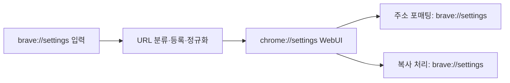

# Brave 브랜딩 구조 분석

확인일: 2026-09-12. Brave 공식 `brave-core`의 조회 시점 `master` 커밋
[`6dde018a8c9a571045e671f1d8d526edfafa4290`](https://github.com/brave/brave-core/commit/6dde018a8c9a571045e671f1d8d526edfafa4290)을 기준으로 소스를 읽었다.
데스크톱 Brave Browser를 중심으로 분석했으며, 브라우저 빌드·실행은 하지 않았다.
아래의 현재 프로젝트 적용안은 소스에서 확인한 사실에 근거한 제안이다.

Brave는 Chromium의 빌드와 WebUI를 유지하면서, 제품 메타데이터·문자열과 번역·
시각 리소스·OS 식별자·내부 URL을 각각 연결한다. 표시 이름 한 필드가 모든 것을
자동으로 바꾸는 구조는 아니다. 우리의 목표인 “나중에 이름을 쉽게 바꾸기”에는
이 연결 지점을 참고하고, 값은 기존 `brand.json`에서 생성하는 방식이 맞는다.

## 1. 제품 메타데이터와 빌드 선택

Brave는 전용 `app/theme/brave/BRANDING`을 둔다. 정식 버전의 전체 이름은
`Brave Browser`, 짧은 이름은 `Brave`, macOS Bundle ID는 `com.brave.Browser`다.
회사·설치 프로그램·서명 팀 정보도 이 파일에 있다. Beta·Nightly·Development는
별도 BRANDING 파일로 관리하며, Beta의 표시 이름과 Bundle ID에는 채널이 들어간다.
[정식 BRANDING](https://github.com/brave/brave-core/blob/6dde018a8c9a571045e671f1d8d526edfafa4290/app/theme/brave/BRANDING),
[Beta BRANDING](https://github.com/brave/brave-core/blob/6dde018a8c9a571045e671f1d8d526edfafa4290/app/theme/brave/BRANDING.beta).

GN 기본값은 `branding_path_component`와 `branding_path_product`를 `brave`로
선택한다. 준비 단계의 `branding.js`는 채널에 맞는 BRANDING과 리소스를 Chromium
경로로 복사한다. macOS 앱과 Helper의 plist에는 별도 Brave 생성 타깃을 연결한다.
[브랜드 선택](https://github.com/brave/brave-core/blob/6dde018a8c9a571045e671f1d8d526edfafa4290/build/args/branding_defaults.gni),
[준비 단계](https://github.com/brave/brave-core/blob/6dde018a8c9a571045e671f1d8d526edfafa4290/build/commands/lib/branding.js),
[앱 빌드 연결](https://github.com/brave/brave-core/blob/6dde018a8c9a571045e671f1d8d526edfafa4290/patches/chrome-BUILD.gn.patch).

**현재 프로젝트 적용안:** 기존 `brand.json` → BRANDING 생성은 유지한다.
전용 theme 디렉터리와 GN 선택자로 확장하는 방식도 가능하지만, 현재 Chromium
theme을 쓰는 방식에서도 리소스 적용 목록을 완전하게 관리하면 된다. 브랜드명
변경을 위한 값과 Chromium 연결 패치를 분리하는 것이 핵심이다.

## 2. 문자열과 번역은 함께 변환한다

Brave는 Chromium 문자열을 Brave 쪽 GRD/GRDP로 매핑한다. 핵심 제품명뿐 아니라
macOS Helper 이름과 카메라·마이크·로컬 네트워크 권한 안내에도 브랜드를 반영한다.
[문자열 매핑](https://github.com/brave/brave-core/blob/6dde018a8c9a571045e671f1d8d526edfafa4290/build/commands/lib/l10nUtil.js),
[브랜드 문자열](https://github.com/brave/brave-core/blob/6dde018a8c9a571045e671f1d8d526edfafa4290/app/brave_strings.grd).

자동 변환에는 브랜드 치환, 의미 변경, 예외 복구 규칙이 있다. 예를 들어
브랜드 치환 후에도 Google Drive·ChromeOS·Chromecast 같은 다른 제품의 이름은
보존하도록 보정한다. 수정 범위는 XML 메시지의 본문·하위 노드·설명 등이다.
[변환 규칙](https://github.com/brave/brave-core/blob/6dde018a8c9a571045e671f1d8d526edfafa4290/script/lib/l10n/grd_string_replacements.py),
[XML 변환](https://github.com/brave/brave-core/blob/6dde018a8c9a571045e671f1d8d526edfafa4290/script/lib/l10n/grd_utils.py).

기존 번역 재사용은 다음 순서다. GRD 메시지 이름·개수를 확인해 원문과 변환문의
fingerprint 매핑을 만들고, 원본 Chromium XTB에서 브랜드 문구와 번역 ID를 함께
변환한다. 브랜드 치환만으로 처리되는 변경과 별도 번역이 필요한 의미 변경을
구분한다. 후자는 `_override.grd`/GRDP로 추출하며, 번역 override를 최종 XTB에
합치는 코드도 있다. 따라서 영어 원문만 바꾸어 번역 해시가 끊기는 문제를
변환 파이프라인에서 다룬다.
[번역 ID 이전과 병합](https://github.com/brave/brave-core/blob/6dde018a8c9a571045e671f1d8d526edfafa4290/script/lib/l10n/grd_utils.py#L172),
[별도 번역 추출](https://github.com/brave/brave-core/blob/6dde018a8c9a571045e671f1d8d526edfafa4290/script/chromium-rebase-l10n.py#L264).

공식 Wiki도 영어 원문 변경 시 번역 해시가 달라진다고 설명한다. 다만 Wiki의
일부 스크립트 경로는 이번 커밋의 `build/commands/lib/` 경로와 다르므로 실제
작업에서는 위의 고정 커밋 소스를 기준으로 삼는다.
[공식 문자열·번역 문서](https://github.com/brave/brave-browser/wiki/Strings-and-Localization).

**현재 프로젝트 적용안:** 현재 세 제품명 ID 연결을 유지하고, 문장 속 브랜드와
Helper·OS 권한 문구로 범위를 넓힌다. 브랜드 치환은 설정값으로 만들고, GRD와
XTB를 같은 원본에서 생성한다. 반복 이름 변경 시 이전 생성물을 다시 치환하지
않도록 한다. 우리 소유 UI의 새 문장은 브랜드명을 매개변수로 넣는 번역 문자열을
사용하면 표시 이름을 바꿀 때 문장 자체의 번역 ID를 유지하기 쉽다.

## 3. 아이콘은 여러 소비 경로를 관리한다

Brave의 준비 코드는 theme 전체와 `default_100_percent`·`default_200_percent`
리소스를 복사한다. 버전 페이지의 로고와 파비콘, Omnibox 벡터 아이콘,
공통 WebUI 로고도 별도 매핑한다. macOS는 채널별 `app.icns`와 `Assets.car`를
둘 다 선택하며, 내용 checksum이 같은 파일은 복사를 생략한다.
[리소스 복사 목록과 채널 선택](https://github.com/brave/brave-core/blob/6dde018a8c9a571045e671f1d8d526edfafa4290/build/commands/lib/branding.js#L114).

**현재 프로젝트 적용안:** 현재 생성기의 ICNS·ICO·일부 PNG에 더해 macOS asset
catalog, 배율별 로고, 버전 페이지, WebUI, 벡터 아이콘의 사용처를 목록으로
관리한다. 래스터 로고에서 만들 수 있는 항목과 별도의 워드마크·벡터 원본이
필요한 항목을 구분하고, 필수 리소스 누락을 preview에서 확인한다.

## 4. OS 식별자는 표시 이름과 별도다

Brave의 Windows install-mode 코드는 전용 설치·프로필 디렉터리, AppID, HTML/PDF
ProgID, GUID, 알림·권한 상승 서비스 식별자를 정의한다. Stable·Beta·Nightly 등도
구분한다. 외부에서 브라우저를 실행하는 scheme인 `brave-browser`는 WebUI 주소의
`brave`와 다르다.
[Windows 설치 식별자](https://github.com/brave/brave-core/blob/6dde018a8c9a571045e671f1d8d526edfafa4290/chromium_src/chrome/install_static/chromium_install_modes.h).

macOS는 전용 Bundle ID 외에도 기본 Keychain 서비스·계정 이름을 지정한다.
다른 브라우저의 데이터를 가져오는 경로에서는 가져올 브라우저의 이름을 선택한다.
Linux 기본 프로필 디렉터리도 Brave 전용 경로와 채널 suffix를 사용한다.
[Keychain 선택](https://github.com/brave/brave-core/blob/6dde018a8c9a571045e671f1d8d526edfafa4290/chromium_src/components/os_crypt/common/keychain_password_mac.mm),
[Linux 프로필 경로](https://github.com/brave/brave-core/blob/6dde018a8c9a571045e671f1d8d526edfafa4290/chromium_src/chrome/common/chrome_paths_linux.cc).

실행 파일 이름도 플랫폼별로 연결한다. Windows는 `brave.exe`, macOS는 제품명
매크로로 Browser·Helper·Framework 경로를 만든다.
[실행 파일 상수](https://github.com/brave/brave-core/blob/6dde018a8c9a571045e671f1d8d526edfafa4290/chromium_src/chrome/common/chrome_constants.cc).

**현재 프로젝트 적용안:** `name`·`short_name`과 별도로 안정적인 `identity`
설정을 둔다. 표시 이름 변경으로 Bundle ID·프로필·Keychain·Windows 등록 키가
자동 변경되지 않도록 한다. 독립 ID를 최초 적용할 때 기존 데이터 이전을 함께
정의한다. 기존 소스의 저작권 표기는 표시 이름 치환 대상에서 제외한다.

## 5. brave://는 입력·정규화·표시·복사를 연결한다

현재 소스에서 확인되는 경로는 다음과 같다.

| 역할 | Brave 구현 |
| --- | --- |
| Scheme 정의 | 기존 `kChromeUIScheme`을 유지하고 `kBraveUIScheme`을 추가 |
| 등록 | `AddAdditionalSchemes`에서 standard·secure·CORS-enabled·savable 목록에 추가 |
| Omnibox 입력 | Brave scheme을 URL로 분류해 검색어로 처리되지 않도록 함 |
| WebUI 연결 | about/sync rewrite 앞에서 Brave scheme을 Chrome scheme으로 정규화 |
| 주소 표시 | LocationBarModelDelegate의 포매팅 결과를 Brave scheme으로 변환 |
| 복사 | Omnibox 복사 유틸리티에서 URL scheme을 별도로 변환 |
| 권한 안내 표시 | security origin 포매터에서도 표시용 scheme을 변환 |

각 연결의 근거:
[scheme 상수](https://github.com/brave/brave-core/blob/6dde018a8c9a571045e671f1d8d526edfafa4290/chromium_src/content/public/common/url_constants.h),
[등록](https://github.com/brave/brave-core/blob/6dde018a8c9a571045e671f1d8d526edfafa4290/common/brave_content_client.cc),
[입력 분류](https://github.com/brave/brave-core/blob/6dde018a8c9a571045e671f1d8d526edfafa4290/browser/autocomplete/brave_autocomplete_scheme_classifier.cc),
[정규화](https://github.com/brave/brave-core/blob/6dde018a8c9a571045e671f1d8d526edfafa4290/chromium_src/chrome/browser/browser_about_handler.cc),
[주소 표시](https://github.com/brave/brave-core/blob/6dde018a8c9a571045e671f1d8d526edfafa4290/browser/ui/toolbar/brave_location_bar_model_delegate.cc),
[복사](https://github.com/brave/brave-core/blob/6dde018a8c9a571045e671f1d8d526edfafa4290/chromium_src/components/omnibox/browser/omnibox_text_util.cc),
[origin 표시](https://github.com/brave/brave-core/blob/6dde018a8c9a571045e671f1d8d526edfafa4290/chromium_src/components/url_formatter/elide_url.cc).

표시용 origin 변환은 기존 WebUI의 실제 origin 전체를 바꾸는 근거가 아니다.
Brave는 내부 URL 상수에도 `chrome://`·`chrome-untrusted://`·`chrome-search://`를
사용한다. 제품 표시를 위해 Chromium scheme 상수를 전역 치환할 필요는 없다.
[남아 있는 내부 URL 상수](https://github.com/brave/brave-core/blob/6dde018a8c9a571045e671f1d8d526edfafa4290/chromium_src/chrome/common/url_constants.h).

브라우저 테스트는 외부 페이지의 iframe·window.open·location.replace·클릭으로
내부 페이지를 여는 경계와 private/guest 모드 제한, crash URL을 다룬다. 2020년
scheme Wiki에는 renderer 등록·권한·history 등 추가 점검 지점도 있지만,
각 API가 지금도 같은 위치에 존재한다고 가정하지 않는다.
[현재 scheme 브라우저 테스트](https://github.com/brave/brave-core/blob/6dde018a8c9a571045e671f1d8d526edfafa4290/browser/brave_scheme_load_browsertest.cc),
[공식 scheme 문서](https://github.com/brave/brave-browser/wiki/Adding-a-protocol-scheme-to-Brave).

**현재 프로젝트 연결:** 사용자의 브랜드 변경 요구에 따라 기본 접두어는
`short_name`의 소문자 값을 사용한다. URL 문법에 맞지 않는 이름은 같은 설정의
`internal_url_scheme`으로 지정한다. 설정에서 공통 helper와 상수를 생성하고
Chromium에는 입력·rewrite·포매팅·복사·드래그와 저장 경로 연결을 둔다.
실제 WebUI origin과 북마크·세션 저장 주소는 Chromium 형식을 유지해 다음
브랜드 빌드에서도 내부 페이지를 복원한다. 메뉴·WebUI 본문 링크·북마크 편집
문자열은 별도 소비 경로를 확인해야 한다.

## 현재 프로젝트 반영 상태

| 상태 | 항목 |
| --- | --- |
| 완료 | `0001` 재생성에서 `0002` 소유 GRD를 제외해 패치 소유와 적용 순서를 분리했다. |
| 완료 | 탭 접근성 안내와 Agent 포인터·질문 제목이 공통 제품명 accessor를 사용하며, 긴 이름에 맞춰 포인터 폭을 계산한다. |
| 남음 | Chromium 문장·Helper·OS 권한 안내와 XTB를 함께 생성하는 변환 단계를 만든다. |
| 남음 | 필수 아이콘·배율·WebUI 리소스 적용 목록과 모든 빌드 진입점의 동기화를 맞춘다. |
| 연결 | 브랜드 설정의 URL 별칭을 입력·표시·복사·드래그와 저장 경로에 연결했다. WebUI 본문 링크와 북마크 편집 문자열은 남아 있다. |
| 남음 | 독립 OS 식별자와 기존 데이터 이전을 별도 checkpoint에서 적용한다. |

Brave의 `BRANDING`·문자열 규칙·scheme·설치 상수에도 브랜드 값이 직접 들어간다.
따라서 연결 지점은 참고하되, 우리 쪽 이름·URL·식별자 값은 설정에서 생성한다.
현재 설정 형식은 [product-branding.md](product-branding.md)에 유지한다.
