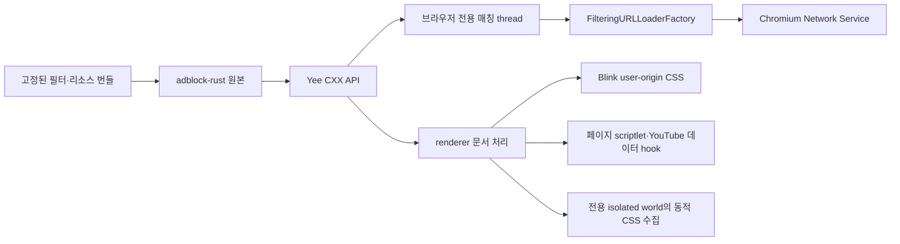

# Yee 네이티브 차단 통합 checkpoint

이 문서는 콘텐츠 차단의 현재 구조, 기능 범위·검증 결과와 남은 작업을 설명하는
단일 진입점이다. 현재 패키지·라이선스 판정과 최종 수치는
[비공개 본체·공개 필터·원본 scriptlet](content-blocking-private-core-filter-data.md)을
따른다. 중간 조사·수정 보고서는 이 문서에 필요한 결론만 합치고 제거했다.

상태: 엔진·요청·페이지 연결, 전체 앱 빌드와 오프라인 회귀 검증, 실제 Yee의
document-start 자동 주입 fixture는 통과했다. 같은 YouTube 영상·프로필의 끔 대조에서
시작·중간 광고와 실제 출력을 확보했고, 켬은 해당 본편 위치를 넘어 약 20분 동안
광고·재생 오류 없이 재생했다. 관측한 영상·프로필·시간 범위의 광고 검증은 완료했다.
실영상 테스트의 40초대 오류는 테스트용 DOM 인터페이스 노출을 제거한 뒤
재생 gate를 통과했다. 원인과 현재 결과는 [40초대 재생 오류](#40초대-재생-오류)에 있다.

## 반복 검토에서 유지한 원칙

- 필터링은 navigation과 subresource의 실제 URLLoaderFactory 경로에 연결하고,
  요청 종류·top origin·redirect마다 사이트 예외를 다시 판정한다.
- malformed selector나 리소스 하나가 정상 규칙 전체를 삼키지 않게 입력 경계를
  분리하되, 권한·checksum·canonical 이름이 불완전한 실행 리소스 묶음은 거부한다.
- 초기 빈 문서, 동적 iframe과 새 JavaScript realm도 document-start 설치보다 먼저
  실행되지 않는지 검증한다. 임시 Chrome fixture는 실제 Yee 연결의 증거로 바꾸지 않는다.
- YouTube 객체는 설치 시점 이후에도 변할 수 있다. 재관찰과 작업량 상한을 함께 두고,
  JSON 문자열은 대상 member span만 제거해 큰 정수와 escape를 보존한다.
- overlay와 vendoring은 검증한 staging tree를 원자적으로 교체한다. 대소문자 충돌,
  파일·디렉터리 전환, stale 파일과 manifest 밖 GN 입력을 적용 전에 거부한다.
- 실행 프로세스는 저장된 이름이 아니라 현재 bundle ID와 실제 executable 경로로
  식별한다. 다른 브라우저나 사용자의 일반 프로필을 정리 대상으로 삼지 않는다.

후속 요청을 반영해 `adblock-rust` 0.13.3 원본을 유지하고, Yee의 Rust/C++ API,
요청 proxy와 문서 처리를 독립 작성했다. 엔진 핵심 파일을 번역하거나 이름을 바꾸어
다른 라이선스로 취급하지 않는다. 원본 엔진은 MPL-2.0이며 배포물에 고지와
해당 소스를 포함하도록 연결했다.

## 실제 연결

제품 원본은 `components/content_blocking/`, `browser/content_blocking/`,
`renderer/content_blocking/`, `third_party/yee_adblock/`에 있다. `build/overlay.json`을 통해
Chromium의 `components/yee_content_blocking/`, `chrome/browser/yee_content_blocking/`,
`chrome/renderer/yee_content_blocking/`, `third_party/rust/yee_adblock/`로 동기화한다.
installer는 owned mirror에서 삭제된 파일도 제거하며 original/generated 경로는 보존한다.

Chromium originals에는 content client 호출, profile service 등록, renderer 설정 전달,
Location Bar host와 GN dependency, Yee isolated world ID만 추가했다. 제품 UI와 사이트
예외 정책은 Yee 소스에 둔다. 기존 `0001`에 전체 변경을 재생성했다. `TabStripModel`,
Omnibox model과 Sidebar 구조, Agent/MCP 실행 코드에는 차단 정책을 넣지 않았다. Yee의
페이지 필터링 world와 MCP의 `CHROME_INTERNAL` world는 분리했다.

## 사이트 컨트롤

일반 Yee 창의 주소창 오른쪽 shield는 Yee 소유 native Site Controls를 **Protection**
탭으로 연다. 왼쪽 site identity는 같은 패널의 **Page info** 탭을 연다. Page info는
현재 `WebContents`의 Chromium 보안 상태와 표시 URL을 읽고 해당 사이트 설정 화면으로
이동하는 action을 제공하지만 Chromium Page Info bubble 자체를 제품 UI로 사용하지
않는다. 분할 화면에서도 Location Bar가 전달한 실제 `WebContents`를 기준으로 한다.

Protection 토글은 프로필 pref에 정확한 hostname 예외를 저장한다. UI thread의 service는
같은 설정을 thread-safe snapshot으로 browser 요청 필터에 제공하고, navigation commit
때 최상위 URL로 줄인 content-setting rule을 renderer에 전달한다. 토글 직후 현재 탭을
reload하므로 network와 document-start 경로가 같은 예외 상태로 시작한다. shield badge는
현재 primary page에서 network 단계가 실제 차단한 요청 수만 표시하고 page 전환 시
초기화한다. 같은 사이트를 표시하는 다른 창의 shield도 pref 변경을 즉시 반영한다.
기존 탭과 shared/service worker의 요청 factory는 유지하면서 요청마다 최신 snapshot을
읽는다. 생성 시점의 프로필 예외 때문에 proxy를 생략하지 않으며, prerender와 BFCache의
비표시 frame에서 보고한 차단은 현재 페이지 badge에 더하지 않는다.

## 요청 처리

- factory chain에서 확장·인증 등의 기존 연결 뒤에 Yee proxy를 추가한다.
- 브라우저의 전용 thread에서 시작 URL, 종류, method와 매칭 출처를 평가한다.
  Subresource는 factory context, navigation은 browser-authored request metadata를 쓴다.
  Main document의 site/source는 이동 URL 자체, iframe의 site는 trusted top origin이다.
  엔진은 해당 thread에서 한 번 만들고 재사용한다. 요청별 UI thread 왕복은 추가하지 않는다.
- 차단 요청은 downstream을 시작하지 않고 `ERR_BLOCKED_BY_CLIENT`로 완료한다.
- server redirect와 client의 redirect URL override도 다시 평가한다.
- 응답 head·body pipe·metadata·upload progress·transfer size를 그대로 전달한다.
- factory clone은 같은 정책과 연결을 공유한다. 요청은 factory/프로필/프레임 raw pointer를
  보관하지 않고 자신의 loader/client pipe를 소유한다.
- 완료와 disconnect는 한 번만 처리한다. upstream client의 completion/disconnect 순서를
  사용해 정상 완료와 loader pipe 종료 사이의 경쟁을 피한다.

요청 종류는 `ResourceType::kMainFrame/kSubFrame`을 먼저 document/subdocument로
분류하고, ping/CSP report도 별도로 구분한 뒤 `RequestDestination`에서 변환한다. fetch/XHR와 sendBeacon을 같은
종류로 처리하지 않는다. 테스트는 ping 전용 규칙으로 beacon을 차단하면서 동일
host의 fetch를 허용하는 것을 확인한다.

사이트 예외는 알려진 HTTP(S) top origin을 기준으로 한다. worker 등의 top metadata가
opaque이고 initiator는 HTTP(S)이면 initiator로 판단한다. 둘 다 opaque이거나 internal
문맥이면 적용하지 않는다. 알려진 web top origin에서 시작한 internal/opaque initiator는
해당 top origin을 매칭 출처로 사용한다. 워커는 frame에 연결되지 않은 요청까지 임의의
탭 badge에 귀속시키지 않는다. 서로 다른 storage partition의 상세 검증은 남아 있다.

## 문서 처리

`RenderFrameCreated`에서 agent를 만들고 `RunScriptsAtDocumentStart`에서 적용한다.
CSS는 Blink의 user-origin stylesheet를 사용한다. 엔진에서 반환한 scriptlet은 페이지
실행 환경에 적용한다. script 실행으로 프레임이 사라지면 weak pointer로 확인해
후속 페이지 처리 및 Chromium extension 호출을 중단한다.

generic CSS는 Yee 전용 isolated world에서 class/id 추가·변경을 모아 전용 worker의
엔진에 비동기로 전달한다. 문서당 한 batch만 진행하고 응답 뒤 대기열을 재개한다.
새 문서와 삭제된 frame의 이전 응답은 weak pointer로 취소하며, 적용 직전 사이트
설정을 다시 확인한다. 처리량과 보관량을 제한하고 idle callback을 사용한다. attribute 변경 때문에
해당 요소의 전체 subtree를 매번 다시 순회하지 않는다. native callback은 보관된 frame
pointer 대신 실행 중인 V8 context에서 살아 있는 frame을 확인한다.
입력 제한을 넘거나 예외 목록을 온전히 읽을 수 없으면 해당 batch를 적용하지 않는다.
예외의 일부를 삭제한 상태로 더 넓게 숨기지 않는다.
대기열이 가득 차면 하나의 증분 재순회로 합치고, 한 요소에 class가 많이 있어도
다음 batch에서 진행을 이어 간다. 너무 긴 UTF-8 class/id 하나 때문에 정상 항목까지
버리지 않도록 수집 단계에서도 입력 크기를 확인한다.

문서 생성 시 weak pointer와 selector/sheet 상태를 초기화하고 같은 문서에는 중복 설치하지 않는다.
전용 isolated world에 security origin과 non-null empty CSP를 설정한다.
`about:blank/srcdoc`은 해당 frame의 상속 HTTP(S) origin으로 판정한다.
CSS는 문서별 dedup과 64 KiB chunk/전체 4 MiB 제한을 적용하며 변경된 tail sheet를 교체한다.
엔진의 `$csp` 결과는 document/subdocument 응답의 기존 서버 정책과 parsed security metadata를
유지하면서 추가 enforce 정책으로 연결한다.
기본 번들은 browser·renderer에 동일하게 포함하고 community data·컴파일 캐시는
pre-sandbox에 읽는다. renderer 시작 때 전용 worker에서 엔진 준비를 시작하고 그
worker에서 계속 사용한다. document-start는 복사된 규칙 결과를 받아 첫 페이지
script 이전에 적용한다. 엔진이 아직 준비되지 않았다면 로컬 결과를 기다리며,
browser IPC·download·중첩 메시지 루프는 사용하지 않는다. browser의 요청 매칭은
기존 전용 sequence에서 처리한다.
초기화·dynamic CSS·iframe·CSP는 실앱 fixture에서 확인했다.

## 데이터와 배포 고지

`adblock-rust`와 60개 의존성을 버전 고정해 `third_party/rust/yee_adblock/`에 포함했다.
기존 Chromium Rust dependency graph를 업데이트하지 않고 private GN 타깃으로
구성했다. registry checksum과 원본 파일 SHA-256을 `manifest.json`에 기록하고,
vendoring 단계에서 Cargo.lock checksum과 61개 registry archive를 검증하고,
archive의 원본 파일 2,145개가 추출된 source와 같은지 확인했다.
고지·소스 묶음을 만들 때 원본 파일이 바뀌지 않았는지 검증한다.
`sources.gni`로 모든 원본 파일과 생성 GN 파일을 packaging action 입력에 연결해,
컴파일된 원본이 바뀌었는데 소스 묶음만 이전 상태로 남는 것을 방지한다.
빌드 중 다운로드는 하지 않는다.

기본 목록은 EasyList·EasyPrivacy와 별도로 식별한 Yee 규칙이다. 목록은 공식
Adblock Plus 서버의 원본을 보존하고, dual license의 CC BY-SA 3.0-or-later 조건을
선택했다. 원저작자, 출처·조회일·hash와 라이선스 URI를 보존한다.
필터와 라이선스 데이터가 기록된 SHA-256과 다르면 생성/packaging을 중단한다.
FlatBuffers와 SeaHash의 published crate에 빠진 전문은 공식 저장소에서 보완하고
별도 출처·hash를 기록했다. 원본 crate 파일은 수정하지 않았다.

기본 실행은 고정된 community pack에서 uBO scriptlet 152개, redirect resource 45개와
Brave resource 17개를 선별해 로드한다. 별도의 내장 Yee resource에는 빈 JavaScript와
빈 MP4 대체 응답만 둔다. 예약 `.test`의 검증 규칙·scriptlet은
`--yee-content-blocking-test-rules`를 켠 경우에만 적용한다. 기본 실행에서 fixture host
차단·global fixture selector·test scriptlet이 없는 것을 검증했다. YouTube 코드는 Yee
자체 모듈이다.

빌드는 `YeeContentBlockingNotices.txt`와 `YeeContentBlockingSources.tar.xz`를 생성한다.
소스 묶음에는 모든 원본 crate와 외부 filter 데이터·고지를 포함한다. 독립 작성한
Yee Rust/C++/JavaScript·test 규칙은 포함하지 않는다. macOS에서는 bundle
data로, 다른 플랫폼에서는 output directory의 파일로 연결했다.
macOS 전체 빌드 후 실제 `Yee.app/Contents/Frameworks/Yee Framework.framework/Resources/`에
두 파일이 포함된 것을 확인했다. source archive에는 적용되는 root `LICENSE`도 포함한다.
Windows 빌드는 아직 검증하지 않았다. 현재 개발 빌드의 `chrome://credits`는 Chromium
sample이므로 외부 배포 전 사용자에게 보이는 고지/source 접근 안내를 추가 확인해야 한다.

현재 목록 갱신은 원본·hash를 다시 고정해 앱을 빌드하는 방식이다. 런타임 updater,
사용자 구독과 이전 generation 복구는 아직 추가하지 않았다. 미지원 조건을 임의로
삭제해 더 넓은 차단 규칙을 만드는 별도 변환기는 없다.

## YouTube 모듈

초기 `ytInitialPlayerResponse` 설정, player/next endpoint의 `Response.json/text`,
XHR 응답에서 확인된 광고 데이터 key를 처리한다. 본 영상 streaming data, captions,
playability 정보는 보존한다. 외부 host의 같은 경로나 다른 endpoint는 처리하지 않는다.
SPA 재설치는 중복 wrapper를 만들지 않는다. 광고를 재생한 뒤 mute/seek하는 방식은 넣지 않았다.
YouTube text JSON은 원문 member span 제거로 숫자 정밀도·escape를 유지한다.
Known player container는 arbitrary enumeration보다 먼저 처리하고, 기존 player 필드의 변경을
보호하면서 객체 identity를 유지한다. XHR text는 동일 URL/내용에 한해 결과를 재사용한다.
작업량 제한은 inherited/own check와 object/property 방문 수도 포함한다. 큰 배열 하나에서
큐를 무제한 늘리지 않고, page-defined getter/Proxy 오류로 player 설정이 깨지지 않도록 처리한다.

### 실제 YouTube 검증

새 비로그인 프로필의 같은 탐색 순서에서 차단 끔의 실제 프리롤과 차단 켬의
광고 없는 본편 시작을 확인했다. 연속 영상 이동과 중간 탐색 후에도 본편 제목·길이·
챕터가 유지됐다. 원격 디버깅 없는 일반 Yee에서 `mfmdXPT7nAM`의 30분 50초
본편이 오류 없이 종료 화면까지 도달했다. 제작자가 본편에 넣은 `AD` 워터마크는
YouTube 광고 플레이어 UI와 구분했다. 시작·중간 광고의 최종 대조 범위는 아래에 둔다.

#### 40초대 재생 오류

native 실영상 테스트의 `--dom-automation`이 실제 페이지에 불필요한
`window.domAutomationController`를 노출했다. 이 환경에서는 차단 끔·켬 모두 본편
약 40초 뒤 오류가 발생했다. 후속 `/videoplayback`은 HTTP 200이지만 영상 대신
123바이트의 UMP 응답을 반복 반환했고, `StreamProtectionStatus`는 `status=3`,
`max_retries=10`이었다. 이는 스트림 인증 거절이며, 초기 버퍼 소진 뒤 플레이어
오류로 이어졌다. 프로토콜 필드와 상태 해석은
[googlevideo의 StreamProtectionStatus 처리](https://github.com/LuanRT/googlevideo/blob/main/src/core/SabrStream.ts)를 참고했다.

같은 Yee 앱에 `--dom-automation`만 추가해 오류를 재현했고, 이를 제거한 일반
실행과 기존 오류 프로필의 재실행에서는 4분 이상 본편이 이어졌다. 이 Yee 대조를
과거 Chrome·Brave 실험 오류의 원인 확정으로 확대하지 않는다.

일반 앱의 CDP 관측 환경도 별도로 대조했다. `--remote-debugging-port=0`은
Chromium의 [runtime feature 설정](https://chromium.googlesource.com/chromium/src/+/25189dfe0a49b3f8324586374b8251b8d12ad1c2/content/child/runtime_features.cc#422)에서
자동화 표시를 활성화한다. 이 실행은 DOM controller가 없어도
`navigator.webdriver=true`였고 본편 42.58초 뒤 플레이어 오류가 났다.
명시적 로컬 디버깅 포트로 다시 실행한 대조는 두 테스트 표시가 모두 false였으며
본편 99.57초를 오류 없이 재생했다. 이후 관측 도구는 명시적 포트를 사용하고
실행 환경을 검사한다. 이 Yee 대조를 과거 Chrome·Brave 오류의 원인 확정으로
확대하지 않는다.

YouTube 전용 native fixture에서 사용하지 않는 DOM controller 스위치를 제거했다.
`EvalJs`는 별도 frame test IPC를 쓰므로 이 전역 객체가 필요하지 않다. 수정은
실영상 테스트의 실행 환경에 적용했다. 2026-09-30의 최종 native 회귀 결과는 다음과 같다.
보고서에서 `navigator.webdriver`와 `domAutomationController`가 모두 false임을
확인했다.

| 실행 | 영상 | 실제 본편 재생 시간 | 오류·멈춤 |
| --- | --- | --- | --- |
| 차단 끔, 연속 | `5EzB_2Qcakw` | 178.45초 | 없음 |
| 차단 켬, 연속 | `5EzB_2Qcakw`, `uq14seOjILU`, `mfmdXPT7nAM` | 각각 88.98 / 86.27 / 88.89초 | 없음 |
| 차단 켬, 두 차례 탐색 | `5EzB_2Qcakw` | 탐색 이동을 제외한 116.39초 | 없음 |

탐색 대조는 6분 4초와 12분 9초로 이동한 뒤에도 재생이 이어졌다.
기존 Site Controls browser gate **20/20**과 최종 테스트 빌드, 앱 빌드도 통과했다.

재실행 도구는 `tools/dev/test-youtube-live.sh off|on`이다. 기본 실행은
`5EzB_2Qcakw`, `uq14seOjILU`, `mfmdXPT7nAM`의 연속 재생이다.
`YEE_LIVE_YOUTUBE_SEEK=1`로 본편 40초·80초 뒤 중간 탐색을 추가할 수 있다.
`YEE_LIVE_YOUTUBE_SECONDS`는 영상별 관측 상한 90~600초,
`YEE_LIVE_YOUTUBE_VIDEO`는 위 세 ID 중 하나만 선택한다.
`YEE_LIVE_YOUTUBE_MIN_CONTENT_SECONDS`는 광고와 탐색 이동을 제외한 최소 본편
재생 시간이며 기본 60초다. 최소값은 60초 이상이고 관측 상한보다 작아야 한다.
프리롤이 길어 최소 본편 시간이 부족하면 관측 상한을 늘려 다시 검증해야 한다.

opt-in native test는 일반 Site Controls gate에서 제외한다. 결과 JSON은
`.local-build/youtube-live/`에 둔다. 성공하려면 플레이어 오류·멈춤이 없고,
최소 본편 재생 시간을 충족하며 마지막 샘플에서도 재생 중이어야 한다.
재생 gate 통과와 대조군의 광고 부재만으로 광고 차단 성공을 판정하지 않는다.
새 광고 노출 회귀를 조사할 때는 같은 영상의 실제 끔 광고·출력과 켬 관측을
비교한다. 오디오 디코딩 수치는 실제 출력 녹음의 증거가 아니다.

일반 앱의 같은 영상(`Qtl8lJwbd4g`)·프로필 대조에서는 본편 1,006.60초 뒤 중간 광고가
전달됐다. 캡처에는 LG U+의 스폰서 영상과 광고 1/2 표시가 있었으며, 약 59초의
광고 구간에서 브라우저 프로세스에 한정한 Core Audio tap으로 실제 비무음 출력
58초를 기록했다. 마이크는 사용하지 않았다. 광고 뒤 본편이 20초 이상
이어졌고 본편 총 1,026.73초를 오류 없이 재생했다. 이 결과로 중간 광고 전달과
출력이 있는 대조군을 확보했다. 같은 영상·프로필의 후속 켬 관측은 본편
1,198.04초와 비무음 본편 출력 1,198초를 기록했고 시작·중간 광고가 없었다.
이어 끔 재대조에는 시작 광고가 다시 전달됐으며 광고의 비무음 출력 134초를
기록했다. 본편 1,047.24초까지 재생해 첫 대조의 중간 광고 위치를 넘었으나
중간 광고는 다시 전달되지 않았다. 세 관측 모두 재생 gate를 통과했고 오류가
없었다. 시작 광고는 끔→켬→끔 대조를 확보했다. 중간 광고는 첫 끔 관측의 실제
광고·출력과 해당 위치를 넘은 켬 관측으로 이번 구현 검증을 완료했다.
서버의 광고 전달 변동은 관측 한계로 기록한다. 이후 차단 코드 변경에는 필요한
회귀 검사를 적용한다.

### 체감 성능

두 가지 비공식 Chromium 기본값이 애니메이션 성능을 낮추고 있었다.

- 비 Chrome 브랜딩의 fieldtrial testing config가 macOS main frame을 60Hz로
  제한했다. `disable_fieldtrial_testing_config = true`로 비활성화했다.
- `is_debug=false`인 비공식 빌드도 `DCHECK`와 `EXPENSIVE_DCHECK`를
  활성화했다. `dcheck_always_on = false`로 production 수준에 맞췄다.

120Hz 환경의 실제 YouTube 검색 결과에서 수정 전 Yee의 첫 스크롤 95백분위
프레임 간격은 약 58ms였다. 전체 재빌드 후 안정 구간은 차단 끔 9.2ms,
차단 켬 9.1ms, Chrome 9.3ms였고 세 경우 모두 16ms 초과 프레임과 long task가
0개였다. 9,608개 요소의 로컬 fixture도 Yee 9.2ms, Chrome 9.3ms였다.
초기 페이지 로딩의 네트워크·비동기 작업에 따른 일시적인 긴 프레임은 별도
개선 범위로 남는다.

반복 정리 최적화 전의 로딩 대조는 콘텐츠 viewport 1,000×720, DPR 2에서 조건별 세 번의 중앙값을
집계했다. 일반 실행은 Chrome과 Yee 모두 창 가림으로 문서가 숨겨져 무효였다.
다음 수치는 양쪽에 같은 `--disable-backgrounding-occluded-windows` 테스트 옵션을
적용한 `test-occlusion-override` 조건이다. 검색 결과는 같은 검색어로 새로 열었고,
영상 전환은 `JsBZOcqZerk`로 맞췄다. 검색 순위가 바뀐 Chrome 한 회의 전환은
제외하고 보충했다.

| 조건 | FCP | LCP | 스크롤 rAF 95백분위 | 영상 제목 표시 |
| --- | --- | --- | --- | --- |
| Chrome 154 | 1,256ms | 1,764ms | 9.3ms | 1,163ms |
| Yee 153, 차단 끔 | 1,204ms | 1,956ms | 9.3ms | 1,394ms |
| Yee 153, 차단 켬 | 1,472ms | 2,032ms | 9.3ms | 1,672ms |

스크롤에는 Yee의 모든 회차에서 long task가 없었고 Chrome은 3 / 0 / 0개였다.
세 조건의 영상 전환 rAF 95백분위도 9.3ms였다. 이는 실제 compositor 출력
프레임이나 INP가 아니다. 영상 준비 신호는 차단 끔에서 시작 광고였으며 차단 켬
한 회는 관측 시간 안에 준비되지 않아 본편 시작 지연의 비교로 사용하지 않았다.
Chromium 버전·네트워크·광고 전달 차이와 세 번의 표본이라는 한계가 있다.
Yee 켬은 끔보다 FCP 268ms, 제목 표시 278ms가 늦었고 초기 long task 합계의
중앙값도 979ms 대 744ms였다. 초기 처리 비용의 추가 CPU 프로파일링 근거이며,
원인이 특정 차단 코드라고 확정한 결과는 아니다.

별도의 두 회 켬·끔 V8 CPU 대조도 완료했다. 영상 전환 후 10초 관측에서
Yee `getPlayerResponse` 래퍼의 `clean()`이 자식 호출을 포함해 227.75 / 224.86ms의
표본 CPU 시간을 사용했다. 실제 호출 스택은 페이지의 플레이어 응답 읽기와
Yee 재생 복구 `check()` 양쪽에서 같은 응답을 반복 정리하는 경로였다.
이 중 제목 표시 전의 비용은 16.26 / 19.63ms였고 새 검색 문서 로딩에는
`clean()` 표본이 없었다. 반복 정리 비용은 구체적인 최적화 대상이지만 초기
표시 지연 전체의 원인으로 확대하지 않는다. CPU 수집 회차는 기존 로딩 비교
표본과 별도로 해석하며, 같은 창 가림 억제 조건과 V8 표본 수집의 한계를 가진다.

2026-10-01에는 변경 불가능한 광고 필드 guard와 이미 설치한 player container
accessor의 상태를 재사용하고 traversal queue의 중복 entry 생성을 줄였다.
데이터 탐색은 유지해 나중에 추가된 일반 하위 객체·known container와 읽기 전용
container 내부의 변경도 정리한다. 해당 변경 시나리오의 회귀 assertion 7개를
추가했고 기존 lossless JSON 71개 case와 protocol/playback 248개 assertion도 통과했다.

| 영상 전환 후 10초의 `clean()` 표본 CPU 시간 | 첫 회 | 둘째 회 | 중앙값 |
| --- | --- | --- | --- |
| 수정 전 | 227.75ms | 224.86ms | 226.31ms |
| 수정 후 | 195.98ms | 166.90ms | 181.44ms |

같은 조건의 두 회 대조에서 이 반복 처리의 중앙값은 약 19.8% 줄었다. 수정 후
스크롤 rAF 95백분위는 9.2 / 9.3ms였고 두 회 모두 스크롤 long task가 없었다.
전체 앱은 병렬 3개로 빌드했고, 정상 종료 후 새 앱의 단일 100초 재생 회귀에서
본편 99.14초와 비무음 출력 98초, 플레이어 오류·멈춤 없음을 확인했다.
두 표본과 서로 다른 수집 시점이라는 한계가 있으며, 이 감소율을 전체 페이지
로딩 시간이나 실제 화면 출력 프레임의 개선율로 해석하지 않는다.

### 첫 문서의 필터 엔진 로딩과 Brave 대조

같은 날 native trace에서 첫 renderer의 필터 엔진 생성이 document-start 처리를
막는 비용을 확인했다. 기존 경로는 각 sequence의 첫 사용 시 전체 기본·trusted
텍스트 목록을 파싱했다. 빌드에서 adblock-rust 0.13.3의 binary snapshot을 만들고,
pre-sandbox에 외부 데이터로 읽도록 변경했다. 기본 bundle과 community pack의
generation·checksum이 일치하는 캐시만 사용한다. 없거나 오래됐거나 손상된
캐시는 기존 텍스트 경로로 복구한다. 외부 리소스의 검증·trusted 권한·sequence
소유권은 유지한다.

| 첫 main renderer의 native 처리 | 텍스트 파싱 | 컴파일 캐시 |
| --- | --- | --- |
| 필터 엔진 생성 | 95.59ms | 32.07ms |
| 첫 document 규칙 적용, 엔진 생성 포함 | 103.05ms | 49.14ms |

이 관측에서 엔진 생성은 약 66%, 첫 document 처리는 약 52% 줄었다.
다른 renderer의 엔진 생성도 86.05ms에서 30.37ms로 줄었지만, 같은 회차의
별도 renderer이며 독립 반복 표본이 아니다. 전후 각각 한 회의 검색 로딩과 영상
전환을 수집했다. 이전과 같은 1,000×720·DPR 2의 `test-occlusion-override` 조건이다.
FCP는 756→1,196ms, LCP는 1,636→1,796ms로 전체 표시 시간이 개선되지는 않았다.
네트워크·페이지 작업·수집 시점의 변동을 포함하므로 native 감소율을 전체 로딩의
개선율로 사용하지 않는다.

설치된 Brave 1.95.104, Chromium 153의 정확한 태그 commit
`b395074596c663e344272cde7f7d7bd3d496e7e9`도 검토했다. Brave는
[DAT cache manager](https://github.com/brave/brave-core/blob/b395074596c663e344272cde7f7d7bd3d496e7e9/components/brave_shields/core/browser/ad_block_dat_cache_manager.cc)로
컴파일 캐시를 관리하고,
[ad block service](https://github.com/brave/brave-core/blob/b395074596c663e344272cde7f7d7bd3d496e7e9/components/brave_shields/content/browser/ad_block_service.cc)는
브라우저 측 sequence의 엔진을 비동기 호출한다.
[engine 로딩](https://github.com/brave/brave-core/blob/b395074596c663e344272cde7f7d7bd3d496e7e9/components/brave_shields/content/browser/ad_block_engine.cc)에서
캐시를 deserialize한 뒤 별도 리소스를 연결한다. Yee의 선택적 컴파일 캐시는
이 로딩 설계를 참고했다. renderer에 엔진을 직접 만드는 Yee의 현재 구조와는
소유 위치가 다르다.

새 Brave 검증 프로필에서 EasyPrivacy 57,343 network / 342 cosmetic,
uBlock filters 64,726 network / 42,702 cosmetic 규칙의 실제 로드를 확인하고
debug mode가 꺼진 상태에서 한 회 수집했다. Yee와 비슷한 필터 계열이며 목록
revision·전체 차단 정책이 동일한 대조는 아니다. 같은 표시 조건의 Brave renderer
`ApplyRules` 최대값은 15.62ms였고, 측정 구간에 renderer 엔진 생성은 없었다.
스크롤 rAF 95백분위는 9.3ms, 스크롤 long task는 0개였다. Brave의 FCP 1,312ms,
LCP 2,252ms, 영상 제목 표시 1,699ms도 단일 회차의 기록으로만 해석한다.
이 대조는 전체 로딩·INP·실제 compositor 출력의 동등성을 입증하지 않는다.

캐시를 포함한 전체 앱 빌드 후 새 Yee의 단일 75초 재생 회귀를 완료했다.
본편 74.50초·비무음 출력 73초를 확인했고 플레이어 오류와 멈춤은 없었다.
활성화한 실제 창에서 완료한 회차만 재생 근거로 사용한다.

### Renderer worker와 문서 시작 비용

adblock-rust의 `single-thread` 설정을 유지하면서 renderer의 전용 worker에서
엔진을 생성·유지하도록 옮겼다. renderer 시작 때 준비를 시작하고, document-start는
규칙 결과를 기다려 첫 페이지 script 전에 적용한다. generic CSS 조회도 같은 worker에서
비동기로 처리한다. 실제 Yee fixture의 끔·켬·사이트 예외 3개 모드에서 첫 inline script,
초기 빈 iframe·상속 origin, dynamic·late·overflow CSS와 CSP의 회귀 검사를 통과했다.

객체의 factory 생성·소유·실행은 공통
[`WorkerOwned<T>`](../components/tasks/worker_owned.h) 어댑터로 분리했다.
Chromium의 `base::SequenceBound`와 함께 사용하며 객체의 생성·실행·해제를
작업 sequence에 유지한다. thread affinity가 필요한 consumer는 전용
`SingleThreadTaskRunner`를 선택한다. 작업 priority·shutdown 정책은 consumer가
정하고, 비동기 응답은 `Then()`에 weak receiver를 연결한다. 문서 시작의 로컬
대기 허용과 DOM batch 제한·사이트 설정은 콘텐츠 차단 계층에 남긴다.
다른 consumer도 일반적인 비동기 호출부터 사용할 수 있으며 동기 대기를 공통
어댑터에 넣지 않는다. 다른 객체를 사용하는 테스트에서 FIFO 상태 변경과 같은
작업 스레드의 생성·해제, 이동 가능한 입력·결과 전달을 검증했다.

같은 1,000×720·DPR 2·`test-occlusion-override` 조건으로 전후 각각 한 회를 비교했다.

| 첫 main renderer의 native 처리 | 캐시, 메인 스레드 초기화 | 캐시, worker 사전 준비 |
| --- | --- | --- |
| 첫 document 규칙 적용 전체 | 49.14ms | 8.12ms |
| document-start의 로컬 결과 대기 | 별도 구간 없음 | 1.10ms |
| 측정 구간 내 renderer 메인 스레드의 엔진 생성 | 32.07ms | 없음 |

이번 첫 document 적용은 약 83.5% 줄었다. 규칙 조회는 worker에서 실행됐고,
측정된 7개 document의 로컬 대기는 모두 1.10ms 이하였다. 엔진 준비가 더 늦은
탐색에서는 생성 완료까지 기다릴 수 있다. 엔진 계산과 메모리는 renderer별로
여전히 필요하다. 측정 구간의 다른 worker 두 개는 생성에 106.44 / 563.36ms,
thread CPU 92.32 / 82.89ms를 사용했다. 첫 main renderer의 사전 준비는 trace 시작
전이어서 전체 생성 CPU의 전후 비교는 하지 않는다.

FCP 1,196→1,200ms, LCP 1,796→1,700ms, 영상 제목 표시 2,082→1,739ms는 단일
표본이다. 전체 로딩 개선을 입증한 결과로 사용하지 않는다. 스크롤 rAF 95백분위는
9.2ms, 스크롤 long task는 0개였다. 전체 앱 빌드 후 단일 75초 재생 회귀에서는
본편 74.40초·비무음 출력 73초, 플레이어 오류와 멈춤 없음을 확인했다.

### 일반 창의 로딩·스크롤·입력 검수

공통 worker 어댑터 적용 후 전체 앱을 병렬 3개로 빌드하고 실제 Yee의
끔·켬·사이트 예외 fixture를 다시 통과했다. 새 비로그인 프로필의 일반 창에서
Chrome 끔과 Yee 켬을 각각 한 회 수집했다. 두 조건 모두 1,000×720·DPR 2이며
가림 억제 옵션을 사용하지 않았다. 초기 로딩·스크롤·영상 전환의 가시성과
포커스 검사를 통과한 완료 회차만 결과에 사용한다.

| 관측 | Chrome 154.0.8037.58, 차단 끔 | Yee 153.0.8005.0, 차단 켬 |
| --- | --- | --- |
| 초기 FCP / LCP | 1,180 / 1,568ms | 1,436 / 1,936ms |
| 첫 응답 시작 | 224.30ms | 242.90ms |
| 영상 전환 후 제목 표시 | 1,244ms | 1,600.90ms |
| 첫 FCP 전 script scope의 구간 합집합 | 390.08ms | 485.16ms |
| 첫 FCP 전 style/layout scope의 구간 합집합 | 21.62ms | 24.22ms |
| 안정 스크롤 rAF 95백분위 | 9.3ms | 9.2ms |
| 스크롤 long task | 0개 | 0개 |
| `GestureScrollUpdate` 입력→출력 중앙값 / 95백분위 | 21.29 / 29.73ms | 29.45 / 30.23ms |

Yee의 첫 document 규칙 적용은 10.75ms였다. 첫 FCP 전 모든 document 적용
구간의 합집합은 18.95ms, 로컬 규칙 대기는 1.43ms였다. script scope에는 페이지와
주입 코드가 함께 포함되므로 함수별 추가 분석 없이 전부 YouTube 비용으로
귀속하지 않는다. HTML parser scope도 script 실행을 포함한다. 서로 다른 scope의
합집합은 겹치므로 더해서 전체 지연으로 해석하지 않는다. 나머지 공백 시간을
전부 네트워크 대기로 취급하지 않는다.

스크롤 구간의 renderer `PipelineReporter`에서 frame source·sequence·layer host로
묶은 575개 / 572개 frame 그룹을 확인했다. Chrome은 완전 출력 568·부분 출력 6·
변경 없음 1개, Yee는 완전 출력 566·부분 출력 4·drop 2개였다. reporter variant 중
smoothness 영향 flag가 있는 그룹은 양쪽 모두 10개였다. fork/backfill reporter를
별도 프레임으로 중복 집계하지 않았다. 이 값은 Chromium의 presentation feedback
기반 진단이며 물리 화면 촬영이나 전체 브라우저의 drop 비율은 아니다.
`EventLatency`도 합성 스크롤 입력의 진단이며 click/key INP를 대체하지 않는다.

초기 로딩 시 main renderer CPU 누계는 4.51 / 6.51초, 전체 renderer RSS 합은
1,328 / 1,432MiB였다. CPU에는 페이지·runtime·trace 작업이 포함되며 RSS에는
공유 페이지가 중복 포함될 수 있다. 엔진만의 CPU·메모리로 귀속하지 않는다.
각 한 표본, 서로 다른 Chromium 버전·차단 정책·네트워크 시점이라는 한계가 있다.
안정 스크롤에서 지속적인 큰 차이는 재현되지 않았다. 사용자의 완료 기준에 따라
rAF·입력 95백분위의 작은 차이와 입력 중앙값 차이는 이번 검수에서 수용하며,
추가 미세 최적화의 완료 gate로 두지 않는다. 초기 로딩 지연은 후속 후보로 남긴다.
전체 상용 브라우저 성능의 동등성을 입증한 결과는 아니다.

### 초기 표시·영상 전환의 함수별 분석

`f428f8f`의 같은 Yee 빌드에서 차단 켬·끔과 Chrome을 각각 한 회 비교했다.
창이 수집 중 숨겨져 세 조건에 같은 `test-occlusion-override`를 적용했다.
V8 표본·native trace와 요청 시각을 함께 수집했으며 안정 스크롤은 생략했다.
이 수치는 위 일반 창의 회차와 합쳐 평균내거나 실제 화면 애니메이션으로
해석하지 않는다. 광고 전달을 기다리는 검사는 수행하지 않았다.

| 관측 | Chrome 끔 | Yee 끔 | Yee 켬 |
| --- | --- | --- | --- |
| FCP / LCP | 1,076 / 1,584ms | 1,152 / 1,632ms | 1,244 / 1,804ms |
| 영상 제목 표시 | 1,237.5ms | 1,287.9ms | 1,789.9ms |
| 첫 응답 / 문서 다운로드 종료 | 249.7 / 818.8ms | 233.2 / 841.8ms | 267.3 / 917.2ms |
| 첫 FCP 전 script 구간 합집합 | 347.70ms | 374.73ms | 399.87ms |
| 가장 긴 초기 script 실행 | 278.13ms | 300.42ms | 302.44ms |

Yee 켬·끔의 첫 표시 차이는 92ms였다. 켬의 main bundle 다운로드는 끔보다
약 103ms 늦게 끝났고, 가장 긴 script 실행은 약 84ms 늦게 시작했지만 실행
길이는 약 2ms 차이였다. CPU 함수는 양쪽 모두 Polymer 초기화·custom element
생성과 연결 경로가 중심이었다. 켬의 첫 FCP 전 문서 규칙 적용 구간 합집합은
26.05ms, worker 결과 대기는 2.16ms였다. 첫 표시 지연 전체를 엔진 준비나
메인 스레드의 장시간 필터 초기화로 설명할 근거는 확보되지 않았다.
다운로드·페이지 처리 시점의 차이가 함께 관측됐다.

영상 제목은 켬이 끔보다 약 502ms 늦었다. 제목 표시 전 Yee YouTube 코드의
직접 표본 시간은 86.45ms, 원본 scriptlet은 3.80ms였다. 그중 `cleanText()`의
하위 호출 포함 시간은 55.84ms, `clean()`은 22.48ms였다. 페이지에는 Polymer
속성 갱신·DOM 생성과 player 크기 조회가 있었다. 주입 함수의 하위 호출에는
위임한 페이지·native 작업도 포함되므로 주입 stack 전체 140.92ms를 전부
추가 차단 비용으로 계산하지 않는다. 함수별 inclusive 값도 서로 겹친다.

코드와 작은 fixture에서 응답 중복 검사를 확인했다. fetch가 player 응답을
`cleanText()`로 검사한 뒤 `.text()`가 같은 응답을 다시 검사한다. 광고 필드가
제거된 응답과 처음부터 광고 필드가 없는 escaped JSON 모두 lossless scanner를
두 번 실행했다. 큰 정수·escape 보존은 유지됐다. 이미 검사한 Response와 clone의
상태를 재사용하는 후속 개선의 근거가 됐다. 관측한 55.84ms 전체가
중복 검사이거나 전부 제거 가능한 시간이라는 뜻은 아니다.

이번 비교는 조건별 한 표본이며 시점·Chromium 버전·차단 정책이 다르다.
main bundle URL의 `am` 인자도 달라 페이지 작업이 완전히 같지 않았다.
제목 검사는 100ms polling과 메인 스레드 지연을 포함한다. V8 cold profile은
응답·context 생성 이후 시작하므로 그 이전 네트워크·browser 작업을 포함하지 않는다.
익명 script는 함수 이름 대신 소유 소스의 일치로 분류했고 source는 메모리에서만
읽었다. 시간 순서가 뒤섞인 CPU sample은 DevTools처럼 timestamp와 함께 정렬했다.
요청의 response event가 loadingFinished보다 늦게 전달될 수 있어 이를 실제 header
도착 시각으로 취급하지 않는다. 남은 비동기·native 구간까지 귀속한 결과는 아니다.
완료 요약은 `.local-build/youtube-review/loading-attribution-summary.json`에 둔다.

### 같은 로딩 조건의 Brave 추가 조사

설치된 Brave 1.95.104 / Chromium 153.0.8010.53을 격리 프로필에서 한 회
수집했다. EasyPrivacy 57,344 network / 342 cosmetic, uBlock filters 64,762
network / 42,704 cosmetic 규칙의 실제 로딩과 debug mode 비활성화를 확인했다.
위 함수 분석과 같은 1,000×720·DPR 2·`test-occlusion-override` 조건이며,
같은 검색 페이지에서 `JsBZOcqZerk` 영상으로 전환했다. 광고를 기다리는 검사는
수행하지 않았다. 이전 Brave 회차와 별개의 표본이다.

| 관측 | Yee 켬 | Brave 기본 Shields |
| --- | --- | --- |
| FCP / LCP | 1,244 / 1,804ms | 1,200 / 1,656ms |
| 영상 제목 표시 | 1,789.9ms | 2,214.1ms |
| 첫 응답 / 문서 다운로드 종료 | 267.3 / 917.2ms | 234.5 / 924.6ms |

Brave의 첫 표시가 44ms, LCP가 148ms 빨랐지만 영상 제목은 424.2ms 늦었다.
단일 회차에서 모든 경로가 더 빠르지는 않았다. Brave 제목 표시 전 scriptlet의
직접 표본 시간은 461.68ms였고 `editObj`가 444.25ms를 차지했다. runtime prefix로
소스를 확인한 함수이며, 관측한 Proxy 래퍼 chain은 player의 크기·시간 조회 등과
함께 실행됐다. 이 값은 원래 페이지와 native 호출까지 포함하는 stack 시간
498.90ms와 구분한다. 다른 익명 Brave 코드는 미확인 분류에 남을 수 있어 전체
Shields 비용을 완전히 귀속한 결과는 아니다.

같은 고정 commit의 [renderer 처리](https://github.com/brave/brave-core/blob/b395074596c663e344272cde7f7d7bd3d496e7e9/components/cosmetic_filters/renderer/cosmetic_filters_js_handler.cc)를
확인했다. Brave는 동기·비동기 cosmetic resource 조회를 가지며, `ApplyRules`에서
scriptlet·procedural action·CSS와 observer bundle을 renderer에 적용한다.
첫 표시 전 main renderer의 `ApplyRules` 두 호출은 합계 21.70ms, 최대 13.50ms,
동기 조회 두 호출은 합계 2.91ms였다. 하위 observer·CSS 시간은 적용 시간에
포함되므로 더해서 계산하지 않는다. 브라우저의 엔진 조회를 비동기 sequence에
두는 설계와 페이지 메인 스레드의 scriptlet 실행 비용은 별개다.

저장소가 보존한 [Brave uBlock 응답 편집 원본](https://github.com/brave/uBlock/blob/06b48b9dfc183f7dee1e6a9abe7e07a213d406f1/src/js/resources/json-edit.js)은
요청 조건을 확인한 뒤 fetch 응답 clone을 파싱·편집하는 경로다. 이 함수 자체에는
Yee의 `Response.prototype.text/json` 전역 재검사 단계가 없다. 다만 다른 scriptlet과
조합될 수 있고 설치된 component revision과도 다를 수 있어 Brave 전체에서
중복 처리가 없다고 결론 내리지 않는다. Yee에서 확인한 응답 중복 검사는 아래의
재사용 변경으로 줄였으며, Brave의 객체 clone/edit 정책을 그대로 복제하지 않는다.

첫 수집은 20초 native trace가 도구의 128MiB 제한을 넘어 실패했다. 브라우저
크래시는 아니었으며 불완전한 결과는 비교에 사용하지 않았다. 완료 회차는 native
trace를 로딩·전환 각각 초기 5초로 제한했고 두 표시 시점은 이 구간 안에 있었다.
V8 수집·관측은 계속됐다. 이전 세 조건은 20초/10초 trace이므로 총 이벤트 수나
전체 trace 비용을 직접 비교하지 않는다. 조건별 시점·Chromium 버전·필터 revision과
main bundle의 `am` 인자가 달랐으며 제목 감지의 100ms polling 한계도 유지한다.
결과는 같은 완료 요약에 추가했고 검증 프로필·로그·실패 자료는 정리했다.

### 응답 본문 검사 결과 재사용

fetch에서 끝까지 검사한 Response를 내부 `WeakSet`에 기록한다. 광고 필드를
제거한 새 응답과 처음부터 수정이 필요 없었던 응답 모두 `.text()` 소비에서
lossless scanner를 다시 실행하지 않는다. 원본 문자열이나 파싱한 데이터를
캐시에 추가로 보관하지 않으며, native clone에는 같은 검사 완료 상태를 전달한다.
다른 realm의 prototype으로 만들어진 clone도 후속 clone에 상태를 전달한다.

크기·깊이·작업량 제한, malformed JSON, 스트림·decoder 오류로 검사를 끝내지
못한 응답에는 완료 상태를 기록하지 않는다. 해당 응답과 fetch 밖에서 생성한
Response는 기존 reader 처리를 유지한다. native 소비를 먼저 수행하므로
`bodyUsed`, 잠긴 본문, 소비 후 재읽기·clone 오류와 스트림 오류가 유지된다.
`.json()`의 파싱된 객체 정리도 유지한다. 수정 범위는 완전히 검사한 본문의
`.text()` 중복 탐색이며, 모든 객체 탐색을 한 번으로 제한하는 변경은 아니다.

메모리에서만 계측한 fixture에서 fetch→text의 scanner 호출이 두 번에서 한 번으로
줄었고, 원본·clone·중첩 clone을 읽어도 추가 호출이 없었다. 큰 정수·지수 표기·escape
보존, 검사 실패의 원본 fallback, 잠긴 본문·스트림 오류를 포함한 protocol/playback
296개 assertion과 기존 lossless JSON 71개 case를 통과했다. 병렬 3개의 전체 앱
빌드를 완료했고, 새 실제 Yee의 파일 탭에서 Response·CSS·대체 미디어 관련 35개
Web API 검사를 통과했다. 해당 파일 fixture는 저장소 소스를 탭에 직접 설치하며 native document-start
자동 주입을 별도로 증명하는 검사는 아니다.

이 변경 뒤 전체 로딩 비교·광고 전달 대조는 반복하지 않는다. 이전 `cleanText()`의
55.84ms 전체가 절감됐다고 주장하지 않으며, 확인한 개선은 중복 실행의 제거다.
한 차례 75초 재생 회귀에서는 본편 72.29초·비무음 출력 71초를 확인했고 오류나
멈춤이 없었다. 도중 창이 숨김 상태로 바뀌어 전면 창의 재생·애니메이션 검증 근거로
사용하지 않는다. webdriver·DOM automation은 비활성화된 상태였다. 완료 요약만
남기고 격리 프로필·로그·출력 수집 임시 파일은 정리한다.

### 대체 MP4의 지원 코덱과 리소스 선택

전체 파일 fixture에서 드러난 MP4 디코딩 실패는 H.264 대체 파일과 현재 Yee의
`USE_PROPRIETARY_CODECS=0` 설정 때문이었다. 기본 `yee-blank.mp4`를 지원되는
VP9 MP4로 다시 생성했다. 32×32·1초·무음을 유지하며 1,831바이트에서 837바이트로
줄었다. 파일 탭에서 metadata 로딩뿐 아니라 프레임 디코딩과 재생 종료를 확인했다.

실제 필터 엔진에서는 커뮤니티 리소스의 원본 별칭이 우선하므로 기본 파일만 바꾸면
`abp-resource:blank-mp4`가 여전히 H.264 `noop-1s.mp4`를 선택했다. Rust adapter에서
이 리소스의 이름·별칭·MIME을 유지하고 Yee의 VP9 본문을 전달한다. 변경 전 원본
입력도 검증하여 잘못된 base64나 MIME을 가진 pack은 계속 전체 거부한다.
나머지 redirect 본문과 별칭 우선순위, vendored 원본과 재현 가능한 배포 pack은 유지한다.
생성 방법과 선택 정책은 [대체 미디어 설명](../components/content_blocking/data/README.md)에 둔다.

새 실제 Yee의 HTTP fixture에서 차단 끔·켬·사이트 예외 세 모드를 통과했다.
켬에서는 실제 `abp-resource:blank-mp4` 차단 경로로 32×32·1초 영상의 프레임을
디코딩하고 재생 종료에 도달했으며, 원래 광고 URL은 테스트 서버에 도달하지 않았다.
완료 회차의 격리 프로필은 정상 종료 후 runner가 제거하고 요약 결과만 남긴다.

### 남은 성능 작업

| 순서 | 남은 지점 | 다음 판단 기준 |
| --- | --- | --- |
| 1 | 영상 전환의 남은 비동기·native 처리 | 약 502ms 차이 전체를 확인된 탐색 함수 시간으로 설명하지 않는다. 실제 변경에 필요할 때 요청 시작 경로·응답 소비·재생 복구와 UI 갱신의 연결을 좁혀 확인한다. |
| 2 | renderer별 엔진 계산·메모리와 준비 전 탐색의 대기 | 사전 준비가 늦는 경우와 여러 renderer의 누적 비용을 확인한 뒤 공유 범위·결과 전달을 판단한다. |

재생·광고 대조는 관측 범위에서 완료했다. 새 관련 변경에는 필요한 집중 회귀를
적용하며, 과거 광고 재전달을 기다리는 관측을 남은 작업으로 두지 않는다.
후보 경로를 먼저 검토하고 실제 변경의 판단에 필요한 범위만 수집한다.
초기 표시·전환의 현재 단일 회차 비교와 작은 스크롤 차이는 수용하며,
위 후보를 성능 검수의 필수 완료 gate로 두지 않는다.

## 제어와 현재 한계

기본 활성 feature 이름은 `YeeContentBlocking`이다.
`--disable-features=YeeContentBlocking`으로 전체 기능을 비활성화할 수 있다.
`--yee-content-blocking-disabled-sites=example.com,www.example.org`는 정확한 top-level
host 예외이며 대소문자는 구분하지 않고 renderer child에도 전달한다. ASCII/punycode
host 입력을 사용하는 임시 CLI 제어다. 제품 UI의 사이트별 예외는 위의 Site Controls에서
프로필 pref에 저장하며, CLI 설정은 개발용 override로 유지한다.

이번 consumer는 차단 결과, 일반 CSS와 generic class/id, 준비된 scriptlet,
지원하는 대체 응답·URL 변환·removeparam을 연결한다. 엔진이 파싱할 수 있는 모든
동작을 실행하는 것은 아니다. procedural/action CSS 전체 실행기는 후속 범위다.
CSP response directive는 위의 document/subdocument 응답 경로에 연결했다.
WebSocket/WebTransport 연결에는 Yee interceptor가 없다. `about:blank/srcdoc` 문서의
cosmetic 처리는 frame의 상속 HTTP(S) origin으로 연결했으며 실제 fixture 탭에서 확인했다.
HTTP 캐시 응답은 요청 proxy를 통과한다. 반면 Service Worker가 CacheStorage에서 직접
돌려주는 응답은 HTTP(S) factory를 거치지 않아 network 규칙으로 차단되지 않는다.
이는 native fixture에서 확인한 경계이며, 차단 성공으로 집계하지 않는다.
inherited/opaque 문맥과 speculative loading의 모든 조합을 검증한 상태는 아니다.
일반 CSS와 document MutationObserver는 shadow root 내부를 관찰하거나 관통하지 않는다.
쿠키 격리·fingerprinting·CNAME 방어까지 포함한 Shields 전체 구현은 아니다.

## 검증 기록

- native core/settings/style/data/공통 worker 51개와 Mojo factory/profile service 50개, 총 **101개 통과**.
  컴파일 캐시와 텍스트 엔진의 network·cosmetic·scriptlet 출력 대조, 두 generation의
  일치 조건, cache checksum 거부와 binary deserialize 실패 시 복구를 포함한다.
  worker의 최초 생성·재사용, 호출 sequence로의 응답·generic 예외와 삭제된 수신자의
  응답 취소도 검증했다. generic JS의 비동기 대기 중 batch 제한과 overflow 재순회도 통과했다.
  공통 worker의 다른 객체 생성·FIFO 실행·작업 스레드 해제와 이동 가능한 입력·결과도 포함한다.
- Site Controls 통합의 전체 앱 빌드와 Browser Surface fast gate **40/40** 통과.
  새 Yee의 로컬 fixture에서 Protection 패널·9건 차단 badge와 site identity의 Page info
  진입을 확인했다. 첫 inline script 이전 주입과 요청 차단·광고 요소 숨김을 확인했고,
  서버에 차단 대상 요청이 도착하지 않았다. 패널은 지원되는 icon style을 사용하며,
  버튼은 탭 삭제를 관찰해 참조·구독을 해제한다. 실제 패널 진입과 앱 종료를 확인했다.
- `./tools/dev/test-site-controls.sh`의 집중 브라우저 통합 테스트 **20/20** 통과.
  native 토글을 눌러 reload 뒤 network 차단과 document-start 주입·광고 요소 숨김이
  함께 켜지고 꺼지는지 확인했다. PRE test와 후속 프로세스로 hostname 예외의
  재시작 유지, Page info 탭 전환·Site settings 이동, 탭 삭제 뒤 버튼 갱신,
  패널이 열린 창의 종료도 확인했다. 30회 탭 전환, 분할 화면의 정확한 pane,
  다중 창의 hostname 예외·badge 갱신, 시크릿 예외의 일반 프로필 격리도 통과했다.
- 같은 gate에서 dedicated worker, 두 client를 연결한 shared/service worker의
  차단 끔→켬→끔 전환, HTTP 캐시와 link prefetch의 예외, prerender의 예외·activation과
  현재 page badge 분리, BFCache의 같은 frame·문서 상태 복원을 검증했다.
  끈 상태에서 생성한 factory가 다시 켠 설정을 적용하지 않던 오류와 prerender 요청이
  primary page badge에 섞이던 오류를 재현하고 수정한 뒤 전체 gate를 다시 통과했다.
  20개에는 Service Worker의 직접 캐시 응답이 network 필터 밖이라는 경계를 확인하는
  테스트도 포함되며, 해당 응답의 광고 차단이 구현됐다는 의미는 아니다.
- tooling **13개 통과**. 기본 공개 source archive 131개 파일과 배포 파일을 byte 단위로
  확인하고, vendored manifest 입력이 모두 Git에 포함되는지 검사했다. 앱의 ABP cache
  입력을 포함한 실제 133개 파일 아카이브만 추출한 별도 확인에서도 다섯 원본 배포
  파일을 byte 단위로 동일하게 재생성했다. 비공개 adapter와 renderer는 제외한다.
- 실제 엔진 출력의 Chrome fixture **1,239개 assertion**, 기존 Web API/CSS/MP4 fixture
  **25개 assertion** 통과. 이는 실제 Yee 자동 주입이나 YouTube 재생 증거가 아니다.
- YouTube lossless JSON **71개 case**, protocol/playback **296개 assertion** 통과.
- 응답 검사 재사용과 VP9 대체 파일 적용 후 새 실제 Yee의 파일 탭에서 Response·CSS·media
  **35개 assertion** 통과. 프레임 디코딩·재생 종료를 확인했다. 파일 fixture의 직접 설치이며
  native 자동 주입 증거와 구분한다.
- `tools/dev/build.sh` 전체 chrome target과 macOS 앱 bundle 검증 통과.
- 실제 YouTube 스크롤 안정 구간에서 Yee 차단 끔·켬과 Chrome 모두 95백분위
  약 9ms, 16ms 초과 프레임과 long task 0개를 확인했다.
- 실제 Yee fixture의 차단 끔·켬·사이트 예외 3개 모드 통과. document-start,
  요청 차단, 정상 응답, cosmetic, iframe, CSP와 예외를 검증했다. VP9 수정 후
  실제 차단 경로의 대체 MP4 프레임 디코딩·재생 종료와 원래 요청의 미전달도 확인했다.
- 실제 YouTube 비로그인 영상의 같은 영상·프로필 대조는 끔의 중간 광고와 실제
  출력 58초, 켬의 광고 없는 약 20분 본편을 확인했다. 이후 반복 처리 최적화는
  새 앱의 단일 100초, 컴파일 캐시와 renderer worker 적용은 각각 단일 75초 재생 회귀를 통과했다.
- owned mirror의 원본 byte 일치, Chromium whitespace와 `0001` reverse apply 검증 통과.

세부 대조군과 배포 파일 수는
[현재 패키지 설계](content-blocking-private-core-filter-data.md)에 둔다.

실앱 fixture는 `tools/dev/test-content-blocking.mjs`다. 별도 프로필의 실제 Yee 탭에서
첫 inline script 이전 적용, fetch·redirect·worker·beacon, 허용 응답 보존, 동적 CSS와
사이트 예외, main/iframe navigation, type-only 규칙, blank/srcdoc 및 strict/filter CSP를 비교한다. 테스트 HTTP 서버가 차단 요청을 받지 않았는지도 확인한다.
실행 전 모든 Yee의 graceful shutdown이 필요하다. runner는 각 launch 전에 실행 중인
stable bundle ID와 실제 executable inventory로 제품 browser process가 없는지 검사한다.
CDP 준비 전/연결 실패 시 자신이 launch한 child PID에만 AppKit 정상 종료를 요청한다.
각 모드의 검증과 정상 종료가 성공하면 격리 프로필을 제거한다. 실패 모드는 진단 자료를 유지한다.
이 gate는 실제 Yee 앱에서 세 모드 모두 통과했다. 라이브 YouTube의 광고 노출과
성능은 네트워크·계정 상태에 영향을 받으므로 위의 수동 통합 결과와 별도로 판단한다.
