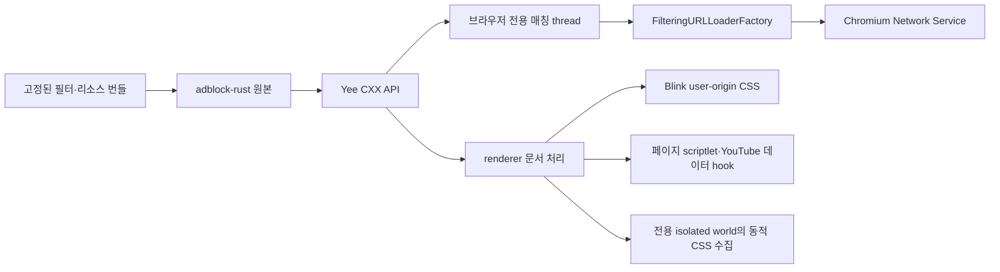

# Yee 네이티브 차단 통합 checkpoint

이 문서는 콘텐츠 차단의 현재 구조, 기능 범위와 남은 검증 항목을 설명하는
단일 진입점이다. 현재 패키지·라이선스 판정과 최종 수치는
[비공개 본체·공개 필터·원본 scriptlet](content-blocking-private-core-filter-data.md)을
따른다. 중간 조사·수정 보고서는 이 문서에 필요한 결론만 합치고 제거했다.

상태: 엔진·요청·페이지 연결, 전체 앱 빌드와 오프라인 회귀 검증, 실제 Yee의
document-start 자동 주입 fixture는 통과했다. 실제 YouTube 대조군에서 프리롤 영상
두 개를 재현했고, 차단 켠 앱에서는 프리롤 없이 본 영상이 시작됐다. 중간 광고,
광고 음성, 영상 전체의 정상 재생은 아직 검증되지 않았다.

## 반복 검토에서 유지한 원칙

- 필터링은 navigation과 subresource의 실제 URLLoaderFactory 경로에 연결하고,
  요청 종류·top origin·redirect마다 사이트 예외를 다시 판정한다.
- malformed selector나 리소스 하나가 정상 규칙 전체를 삼키지 않게 입력 경계를
  분리하되, 권한·checksum·canonical 이름이 불완전한 실행 리소스 묶음은 거부한다.
- 초기 빈 문서, 동적 iframe과 새 JavaScript realm도 document-start 설치보다 먼저
  실행되지 않는지 검증한다. 임시 Chrome fixture는 실제 Yee 연결의 증거로 바꾸지 않는다.
- YouTube 객체는 설치 시점 이후에도 변할 수 있다. 재관찰과 작업량 상한을 함께 두고,
  JSON 문자열은 대상 member span만 제거해 큰 정수와 escape를 보존한다.
- overlay와 vendoring은 검증한 staging tree를 원자적으로 교체한다. 대소문자 충돌,
  파일·디렉터리 전환, stale 파일과 manifest 밖 GN 입력을 적용 전에 거부한다.
- 실행 프로세스는 저장된 이름이 아니라 현재 bundle ID와 실제 executable 경로로
  식별한다. 다른 브라우저나 사용자의 일반 프로필을 정리 대상으로 삼지 않는다.

후속 요청을 반영해 `adblock-rust` 0.13.3 원본을 유지하고, Yee의 Rust/C++ API,
요청 proxy와 문서 처리를 독립 작성했다. 엔진 핵심 파일을 번역하거나 이름을 바꾸어
다른 라이선스로 취급하지 않는다. 원본 엔진은 MPL-2.0이며 배포물에 고지와
해당 소스를 포함하도록 연결했다.

## 실제 연결

제품 원본은 `components/content_blocking/`, `browser/content_blocking/`,
`renderer/content_blocking/`, `third_party/yee_adblock/`에 있다. `build/overlay.json`을 통해
Chromium의 `components/yee_content_blocking/`, `chrome/browser/yee_content_blocking/`,
`chrome/renderer/yee_content_blocking/`, `third_party/rust/yee_adblock/`로 동기화한다.
installer는 owned mirror에서 삭제된 파일도 제거하며 original/generated 경로는 보존한다.

Chromium originals에는 content client 호출, GN dependency와 Yee isolated world ID만
추가했다. 기존 `0001`에 전체 변경을 재생성했다. `TabStripModel`, Omnibox와 Sidebar
구조, Agent/MCP 실행 코드에는 차단 정책을 넣지 않았다. Yee의 페이지 필터링 world와
MCP의 `CHROME_INTERNAL` world는 분리했다.

## 요청 처리

- factory chain에서 확장·인증 등의 기존 연결 뒤에 Yee proxy를 추가한다.
- 브라우저의 전용 thread에서 시작 URL, 종류, method와 매칭 출처를 평가한다.
  Subresource는 factory context, navigation은 browser-authored request metadata를 쓴다.
  Main document의 site/source는 이동 URL 자체, iframe의 site는 trusted top origin이다.
  엔진은 해당 thread에서 한 번 만들고 재사용한다. 요청별 UI thread 왕복은 추가하지 않는다.
- 차단 요청은 downstream을 시작하지 않고 `ERR_BLOCKED_BY_CLIENT`로 완료한다.
- server redirect와 client의 redirect URL override도 다시 평가한다.
- 응답 head·body pipe·metadata·upload progress·transfer size를 그대로 전달한다.
- factory clone은 같은 정책과 연결을 공유한다. 요청은 factory/프로필/프레임 raw pointer를
  보관하지 않고 자신의 loader/client pipe를 소유한다.
- 완료와 disconnect는 한 번만 처리한다. upstream client의 completion/disconnect 순서를
  사용해 정상 완료와 loader pipe 종료 사이의 경쟁을 피한다.

요청 종류는 `ResourceType::kMainFrame/kSubFrame`을 먼저 document/subdocument로
분류하고, ping/CSP report도 별도로 구분한 뒤 `RequestDestination`에서 변환한다. fetch/XHR와 sendBeacon을 같은
종류로 처리하지 않는다. 테스트는 ping 전용 규칙으로 beacon을 차단하면서 동일
host의 fetch를 허용하는 것을 확인한다.

사이트 예외는 알려진 HTTP(S) top origin을 기준으로 한다. worker 등의 top metadata가
opaque이고 initiator는 HTTP(S)이면 initiator로 판단한다. 둘 다 opaque이거나 internal
문맥이면 적용하지 않는다. 알려진 web top origin에서 시작한 internal/opaque initiator는
해당 top origin을 매칭 출처로 사용한다. 복수 client의 shared/service worker 및
partition별 예외의 정확한 전달은 실제 통합 검증이 남아 있다.

## 문서 처리

`RenderFrameCreated`에서 agent를 만들고 `RunScriptsAtDocumentStart`에서 적용한다.
CSS는 Blink의 user-origin stylesheet를 사용한다. 엔진에서 반환한 scriptlet은 페이지
실행 환경에 적용한다. script 실행으로 프레임이 사라지면 weak pointer로 확인해
후속 페이지 처리 및 Chromium extension 호출을 중단한다.

generic CSS는 Yee 전용 isolated world에서 class/id 추가·변경을 모아 native 엔진에
전달한다. 처리량과 보관량을 제한하고 idle callback을 사용한다. attribute 변경 때문에
해당 요소의 전체 subtree를 매번 다시 순회하지 않는다. native callback은 보관된 frame
pointer 대신 실행 중인 V8 context에서 살아 있는 frame을 확인한다.
입력 제한을 넘거나 예외 목록을 온전히 읽을 수 없으면 해당 batch를 적용하지 않는다.
예외의 일부를 삭제한 상태로 더 넓게 숨기지 않는다.
대기열이 가득 차면 하나의 증분 재순회로 합치고, 한 요소에 class가 많이 있어도
다음 batch에서 진행을 이어 간다. 너무 긴 UTF-8 class/id 하나 때문에 정상 항목까지
버리지 않도록 수집 단계에서도 입력 크기를 확인한다.

문서 생성 시 weak pointer와 selector/sheet 상태를 초기화하고 같은 문서에는 중복 설치하지 않는다.
전용 isolated world에 security origin과 non-null empty CSP를 설정한다.
`about:blank/srcdoc`은 해당 frame의 상속 HTTP(S) origin으로 판정한다.
CSS는 문서별 dedup과 64 KiB chunk/전체 4 MiB 제한을 적용하며 변경된 tail sheet를 교체한다.
엔진의 `$csp` 결과는 document/subdocument 응답의 기존 서버 정책과 parsed security metadata를
유지하면서 추가 enforce 정책으로 연결한다.
기본 번들을 두 프로세스에 동일하게 포함하므로 document-start의 async Mojo 조회나
download 대기가 없다. 초기화·dynamic CSS·iframe·CSP는 실앱 fixture에서 확인했다.
BFCache 복원은 별도 실앱 확인이 남았다. callback 자체는 다른 문서의 준비 결과를 기다리지 않는다.

## 데이터와 배포 고지

`adblock-rust`와 60개 의존성을 버전 고정해 `third_party/rust/yee_adblock/`에 포함했다.
기존 Chromium Rust dependency graph를 업데이트하지 않고 private GN 타깃으로
구성했다. registry checksum과 원본 파일 SHA-256을 `manifest.json`에 기록하고,
vendoring 단계에서 Cargo.lock checksum과 61개 registry archive를 검증하고,
archive의 원본 파일 2,145개가 추출된 source와 같은지 확인했다.
고지·소스 묶음을 만들 때 원본 파일이 바뀌지 않았는지 검증한다.
`sources.gni`로 모든 원본 파일과 생성 GN 파일을 packaging action 입력에 연결해,
컴파일된 원본이 바뀌었는데 소스 묶음만 이전 상태로 남는 것을 방지한다.
빌드 중 다운로드는 하지 않는다.

기본 목록은 EasyList·EasyPrivacy와 별도로 식별한 Yee 규칙이다. 목록은 공식
Adblock Plus 서버의 원본을 보존하고, dual license의 CC BY-SA 3.0-or-later 조건을
선택했다. 원저작자, 출처·조회일·hash와 라이선스 URI를 보존한다.
필터와 라이선스 데이터가 기록된 SHA-256과 다르면 생성/packaging을 중단한다.
FlatBuffers와 SeaHash의 published crate에 빠진 전문은 공식 저장소에서 보완하고
별도 출처·hash를 기록했다. 원본 crate 파일은 수정하지 않았다.

기본 실행은 고정된 community pack에서 uBO scriptlet 152개, redirect resource 45개와
Brave resource 17개를 선별해 로드한다. 별도의 내장 Yee resource에는 빈 JavaScript와
빈 MP4 대체 응답만 둔다. 예약 `.test`의 검증 규칙·scriptlet은
`--yee-content-blocking-test-rules`를 켠 경우에만 적용한다. 기본 실행에서 fixture host
차단·global fixture selector·test scriptlet이 없는 것을 검증했다. YouTube 코드는 Yee
자체 모듈이다.

빌드는 `YeeContentBlockingNotices.txt`와 `YeeContentBlockingSources.tar.xz`를 생성한다.
소스 묶음에는 모든 원본 crate와 외부 filter 데이터·고지를 포함한다. 독립 작성한
Yee Rust/C++/JavaScript·test 규칙은 포함하지 않는다. macOS에서는 bundle
data로, 다른 플랫폼에서는 output directory의 파일로 연결했다.
macOS 전체 빌드 후 실제 `Yee.app/Contents/Frameworks/Yee Framework.framework/Resources/`에
두 파일이 포함된 것을 확인했다. source archive에는 적용되는 root `LICENSE`도 포함한다.
Windows 빌드는 아직 검증하지 않았다. 현재 개발 빌드의 `chrome://credits`는 Chromium
sample이므로 외부 배포 전 사용자에게 보이는 고지/source 접근 안내를 추가 확인해야 한다.

현재 목록 갱신은 원본·hash를 다시 고정해 앱을 빌드하는 방식이다. 런타임 updater,
사용자 구독과 이전 generation 복구는 아직 추가하지 않았다. 미지원 조건을 임의로
삭제해 더 넓은 차단 규칙을 만드는 별도 변환기는 없다.

## YouTube 모듈

초기 `ytInitialPlayerResponse` 설정, player/next endpoint의 `Response.json/text`,
XHR 응답에서 확인된 광고 데이터 key를 처리한다. 본 영상 streaming data, captions,
playability 정보는 보존한다. 외부 host의 같은 경로나 다른 endpoint는 처리하지 않는다.
SPA 재설치는 중복 wrapper를 만들지 않는다. 광고를 재생한 뒤 mute/seek하는 방식은 넣지 않았다.
YouTube text JSON은 원문 member span 제거로 숫자 정밀도·escape를 유지한다.
Known player container는 arbitrary enumeration보다 먼저 처리하고, 기존 player 필드의 변경을
보호하면서 객체 identity를 유지한다. XHR text는 동일 URL/내용에 한해 결과를 재사용한다.
작업량 제한은 inherited/own check와 object/property 방문 수도 포함한다. 큰 배열 하나에서
큐를 무제한 늘리지 않고, page-defined getter/Proxy 오류로 player 설정이 깨지지 않도록 처리한다.

### 실제 YouTube 검증

비로그인 새 프로필의 동일한 탐색 순서에서 차단 끔은 15초와 30초 프리롤을
연속 재생한 뒤 본 영상을 시작했다. 차단 켬은 광고 데이터가 제거됐고 프리롤 없이
본 영상을 시작했다. 디버깅 옵션이 없는 일반 Yee UI에서는 본 영상이 1분 38초까지
연속 재생됐고, 8분 35초와 17분 10초로 이동한 뒤에도 정상 재생됐다.

임시 프로필과 원격 디버깅을 사용한 자동화에서는 Yee, Chrome, Brave가 모두
42~44초 부근에서 같은 재생 오류를 보였다. 일반 Yee와 Brave에서는 재현되지 않아
제품 회귀로 판정하지 않았고 자동화 환경 전용 복구도 제품 코드에 넣지 않았다.
라이브 YouTube 결과는 광고 전달, 계정과 A/B 상태에 따라 달라질 수
있으므로 중간 광고, 광고 음성 및 영상 전체 재생은 계속 별도 수용 항목으로 둔다.

### 체감 성능

두 가지 비공식 Chromium 기본값이 애니메이션 성능을 낮추고 있었다.

- 비 Chrome 브랜딩의 fieldtrial testing config가 macOS main frame을 60Hz로
  제한했다. `disable_fieldtrial_testing_config = true`로 비활성화했다.
- `is_debug=false`인 비공식 빌드도 `DCHECK`와 `EXPENSIVE_DCHECK`를
  활성화했다. `dcheck_always_on = false`로 production 수준에 맞췄다.

120Hz 환경의 실제 YouTube 검색 결과에서 수정 전 Yee의 첫 스크롤 95백분위
프레임 간격은 약 58ms였다. 전체 재빌드 후 안정 구간은 차단 끔 9.2ms,
차단 켬 9.1ms, Chrome 9.3ms였고 세 경우 모두 16ms 초과 프레임과 long task가
0개였다. 9,608개 요소의 로컬 fixture도 Yee 9.2ms, Chrome 9.3ms였다.
초기 페이지 로딩의 네트워크·비동기 작업에 따른 일시적인 긴 프레임은 별도
개선 범위로 남는다.

## 제어와 현재 한계

기본 활성 feature 이름은 `YeeContentBlocking`이다.
`--disable-features=YeeContentBlocking`으로 전체 기능을 비활성화할 수 있다.
`--yee-content-blocking-disabled-sites=example.com,www.example.org`는 정확한 top-level
host 예외이며 대소문자는 구분하지 않고 renderer child에도 전달한다. ASCII/punycode
host 입력을 사용하는 임시 CLI 제어다. UI·영구 프로필 설정은 아직 만들지 않았다.

이번 consumer는 차단 결과, 일반 CSS와 generic class/id, 준비된 scriptlet,
지원하는 대체 응답·URL 변환·removeparam을 연결한다. 엔진이 파싱할 수 있는 모든
동작을 실행하는 것은 아니다. procedural/action CSS 전체 실행기는 후속 범위다.
CSP response directive는 위의 document/subdocument 응답 경로에 연결했다.
WebSocket/WebTransport 연결에는 Yee interceptor가 없다. `about:blank/srcdoc` 문서의
cosmetic 처리는 frame의 상속 HTTP(S) origin으로 연결했으며 실제 fixture 탭에서 확인했다.
HTTP(S) factory를 거치지 않는 service worker/cache
응답, inherited/opaque 문맥과 prefetch/prerender의 상세 범위는 별도 통합 검증이 남았다.
일반 CSS와 document MutationObserver는 shadow root 내부를 관찰하거나 관통하지 않는다.
쿠키 격리·fingerprinting·CNAME 방어까지 포함한 Shields 전체 구현은 아니다.

## 검증 기록

- native core/settings/style/data 42개와 Mojo factory 47개, 총 **89개 통과**.
- tooling **13개 통과**. 공개 source archive 129개 파일과 배포 파일을 byte 단위로 확인하고,
  vendored manifest 입력이 모두 Git에 포함되는지 검사했다.
- 실제 엔진 출력의 Chrome fixture **1,239개 assertion**, 기존 Web API/CSS/MP4 fixture
  **25개 assertion** 통과. 이는 실제 Yee 자동 주입이나 YouTube 재생 증거가 아니다.
- YouTube lossless JSON **71개 case**, protocol/playback **248개 assertion** 통과.
- `tools/dev/build.sh` 전체 chrome target과 macOS 앱 bundle 검증 통과.
- 실제 YouTube 스크롤 안정 구간에서 Yee 차단 끔·켬과 Chrome 모두 95백분위
  약 9ms, 16ms 초과 프레임과 long task 0개를 확인했다.
- 실제 Yee fixture의 차단 끔·켬·사이트 예외 3개 모드 통과. document-start,
  요청 차단, 정상 응답, cosmetic, iframe, CSP와 예외를 검증했다.
- 실제 YouTube 비로그인 영상에서 차단 끔·켬의 광고 데이터 차이를 확인했다.
  추가 탐색의 MrBeast 영상에서 대조군의 15초·30초 프리롤 두 개와 차단 켠 앱의
  광고 없는 본 영상 시작을 확인했다. 중간 광고·광고 음성·영상 전체 재생은 검증하지 않았다.
- owned 입력 167개와 원본 116개 hash, Chromium whitespace와 `0001` reverse apply 검증 통과.

세부 대조군과 배포 파일 수는
[현재 패키지 설계](content-blocking-private-core-filter-data.md)에 둔다.

실앱 fixture는 `tools/dev/test-content-blocking.mjs`다. 별도 프로필의 실제 Yee 탭에서
첫 inline script 이전 적용, fetch·redirect·worker·beacon, 허용 응답 보존, 동적 CSS와
사이트 예외, main/iframe navigation, type-only 규칙, blank/srcdoc 및 strict/filter CSP를 비교한다. 테스트 HTTP 서버가 차단 요청을 받지 않았는지도 확인한다.
실행 전 모든 Yee의 graceful shutdown이 필요하다. runner는 각 launch 전에 실행 중인
stable bundle ID와 실제 executable inventory로 제품 browser process가 없는지 검사한다.
CDP 준비 전/연결 실패 시 자신이 launch한 child PID에만 AppKit 정상 종료를 요청한다.
이 gate는 실제 Yee 앱에서 세 모드 모두 통과했다. 라이브 YouTube의 광고 노출과
성능은 네트워크·계정 상태에 영향을 받으므로 위의 수동 통합 결과와 별도로 판단한다.
