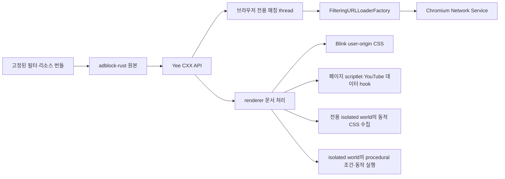

# Yee 네이티브 차단 통합 checkpoint

이 문서는 콘텐츠 차단의 현재 구조, 기능 범위·검증 결과와 남은 작업을 설명하는
단일 진입점이다. 기존 광고·재생·성능 확인 기준은 `8c49d6f`(2026-10-02)이며,
procedural/action cosmetic은 아래 별도 로컬 fixture로 검증했다. 패키지·라이선스 판정은
[비공개 본체·공개 필터·원본 scriptlet](content-blocking-private-core-filter-data.md)을
따른다. 완료된 중간 회차·실패 로그 대신 현재 구조와 검증 결론을 유지한다.

상태: 엔진·요청·페이지 연결, 전체 앱 빌드와 오프라인 회귀 검증, 실제 Yee의
document-start 자동 주입 fixture는 통과했다. 같은 YouTube 영상·프로필의 끔 대조에서
시작·중간 광고와 실제 출력을 확보했고, 켬은 해당 본편 위치를 넘어 약 20분 동안
광고·재생 오류 없이 재생했다. 관측한 영상·프로필·시간 범위의 광고 검증은 완료했다.
실영상 테스트의 40초대 오류는 테스트용 DOM 인터페이스 노출을 제거한 뒤
재생 gate를 통과했다. 원인과 현재 결과는 [40초대 재생 오류](#40초대-재생-오류)에 있다.

## 반복 검토에서 유지한 원칙

- 필터링은 navigation과 subresource의 실제 URLLoaderFactory 경로에 연결하고,
  요청 종류·top origin·redirect마다 사이트 예외를 다시 판정한다.
- malformed selector나 리소스 하나가 정상 규칙 전체를 삼키지 않게 입력 경계를
  분리하되, 권한·checksum·canonical 이름이 불완전한 실행 리소스 묶음은 거부한다.
- 초기 빈 문서, 동적 iframe과 새 JavaScript realm도 document-start 설치보다 먼저
  실행되지 않는지 검증한다. 임시 Chrome fixture는 실제 Yee 연결의 증거로 바꾸지 않는다.
- YouTube 객체는 설치 시점 이후에도 변할 수 있다. 재관찰과 작업량 상한을 함께 두고,
  JSON 문자열은 대상 member span만 제거해 큰 정수와 escape를 보존한다.
- overlay와 vendoring은 검증한 staging tree를 원자적으로 교체한다. 대소문자 충돌,
  파일·디렉터리 전환, stale 파일과 manifest 밖 GN 입력을 적용 전에 거부한다.
- 실행 프로세스는 저장된 이름이 아니라 현재 bundle ID와 실제 executable 경로로
  식별한다. 다른 브라우저나 사용자의 일반 프로필을 정리 대상으로 삼지 않는다.

후속 요청을 반영해 `adblock-rust` 0.13.3 원본을 유지하고, Yee의 Rust/C++ API,
요청 proxy와 문서 처리를 독립 작성했다. 엔진 핵심 파일을 번역하거나 이름을 바꾸어
다른 라이선스로 취급하지 않는다. 원본 엔진은 MPL-2.0이며 배포물에 고지와
해당 소스를 포함하도록 연결했다.

## 실제 연결

제품 원본은 `components/content_blocking/`, `browser/content_blocking/`,
`renderer/content_blocking/`, `third_party/yee_adblock/`에 있다. `build/overlay.json`을 통해
Chromium의 `components/yee_content_blocking/`, `chrome/browser/yee_content_blocking/`,
`chrome/renderer/yee_content_blocking/`, `third_party/rust/yee_adblock/`로 동기화한다.
installer는 owned mirror에서 삭제된 파일도 제거하며 original/generated 경로는 보존한다.

Chromium originals에는 content client 호출, profile service 등록, renderer 설정 전달,
Location Bar host와 GN dependency, Yee isolated world ID만 추가했다. 제품 UI와 사이트
예외 정책은 Yee 소스에 둔다. 기존 `0001`에 전체 변경을 재생성했다. `TabStripModel`,
Omnibox model과 Sidebar 구조, Agent/MCP 실행 코드에는 차단 정책을 넣지 않았다. Yee의
페이지 필터링 world와 MCP의 `CHROME_INTERNAL` world는 분리했다.

## 사이트 컨트롤

일반 Yee 창의 주소창 오른쪽 shield는 Yee 소유 native Site Controls를 **Protection**
탭으로 연다. 왼쪽 site identity는 같은 패널의 **Page info** 탭을 연다. Page info는
현재 `WebContents`의 Chromium 보안 상태와 표시 URL을 읽고 해당 사이트 설정 화면으로
이동하는 action을 제공하지만 Chromium Page Info bubble 자체를 제품 UI로 사용하지
않는다. 분할 화면에서도 Location Bar가 전달한 실제 `WebContents`를 기준으로 한다.

Protection 토글은 프로필 pref에 정확한 hostname 예외를 저장한다. UI thread의 service는
같은 설정을 thread-safe snapshot으로 browser 요청 필터에 제공하고, navigation commit
때 최상위 URL로 줄인 content-setting rule을 renderer에 전달한다. 토글 직후 현재 탭을
reload하므로 network와 document-start 경로가 같은 예외 상태로 시작한다. shield badge는
현재 primary page에서 network 단계가 실제 차단한 요청 수만 표시하고 page 전환 시
초기화한다. 같은 사이트를 표시하는 다른 창의 shield도 pref 변경을 즉시 반영한다.
기존 탭과 shared/service worker의 요청 factory는 유지하면서 요청마다 최신 snapshot을
읽는다. 생성 시점의 프로필 예외 때문에 proxy를 생략하지 않으며, prerender와 BFCache의
비표시 frame에서 보고한 차단은 현재 페이지 badge에 더하지 않는다.

## 요청 처리

- factory chain에서 확장·인증 등의 기존 연결 뒤에 Yee proxy를 추가한다.
- 브라우저의 전용 thread에서 시작 URL, 종류, method와 매칭 출처를 평가한다.
  Subresource는 factory context, navigation은 browser-authored request metadata를 쓴다.
  Main document의 site/source는 이동 URL 자체, iframe의 site는 trusted top origin이다.
  엔진은 해당 thread에서 한 번 만들고 재사용한다. 요청별 UI thread 왕복은 추가하지 않는다.
- 차단 요청은 downstream을 시작하지 않고 `ERR_BLOCKED_BY_CLIENT`로 완료한다.
- server redirect와 client의 redirect URL override도 다시 평가한다.
- 응답 head·body pipe·metadata·upload progress·transfer size를 그대로 전달한다.
- factory clone은 같은 정책과 연결을 공유한다. 요청은 factory/프로필/프레임 raw pointer를
  보관하지 않고 자신의 loader/client pipe를 소유한다.
- 완료와 disconnect는 한 번만 처리한다. upstream client의 completion/disconnect 순서를
  사용해 정상 완료와 loader pipe 종료 사이의 경쟁을 피한다.

요청 종류는 `ResourceType::kMainFrame/kSubFrame`을 먼저 document/subdocument로
분류하고, ping/CSP report도 별도로 구분한 뒤 `RequestDestination`에서 변환한다. fetch/XHR와 sendBeacon을 같은
종류로 처리하지 않는다. 테스트는 ping 전용 규칙으로 beacon을 차단하면서 동일
host의 fetch를 허용하는 것을 확인한다.

사이트 예외는 알려진 HTTP(S) top origin을 기준으로 한다. worker 등의 top metadata가
opaque이고 initiator는 HTTP(S)이면 initiator로 판단한다. 둘 다 opaque이거나 internal
문맥이면 적용하지 않는다. 알려진 web top origin에서 시작한 internal/opaque initiator는
해당 top origin을 매칭 출처로 사용한다. 워커는 frame에 연결되지 않은 요청까지 임의의
탭 badge에 귀속시키지 않는다. 서로 다른 storage partition의 상세 검증은 남아 있다.

## 문서 처리

`RenderFrameCreated`에서 agent를 만들고 `RunScriptsAtDocumentStart`에서 적용한다.
CSS는 Blink의 user-origin stylesheet를 사용한다. 엔진에서 반환한 scriptlet은 페이지
실행 환경에 적용한다. script 실행으로 프레임이 사라지면 weak pointer로 확인해
후속 페이지 처리 및 Chromium extension 호출을 중단한다.

generic CSS는 Yee 전용 isolated world에서 class/id 추가·변경을 모아 전용 worker의
엔진에 비동기로 전달한다. 문서당 한 batch만 진행하고 응답 뒤 대기열을 재개한다.
새 문서와 삭제된 frame의 이전 응답은 weak pointer로 취소하며, 적용 직전 사이트
설정을 다시 확인한다. 처리량과 보관량을 제한하고 idle callback을 사용한다. attribute 변경 때문에
해당 요소의 전체 subtree를 매번 다시 순회하지 않는다. native callback은 보관된 frame
pointer 대신 실행 중인 V8 context에서 살아 있는 frame을 확인한다.
입력 제한을 넘거나 예외 목록을 온전히 읽을 수 없으면 해당 batch를 적용하지 않는다.
예외의 일부를 삭제한 상태로 더 넓게 숨기지 않는다.
대기열이 가득 차면 하나의 증분 재순회로 합치고, 한 요소에 class가 많이 있어도
다음 batch에서 진행을 이어 간다. 너무 긴 UTF-8 class/id 하나 때문에 정상 항목까지
버리지 않도록 수집 단계에서도 입력 크기를 확인한다.

문서 생성 시 weak pointer와 selector/sheet 상태를 초기화하고 같은 문서에는 중복 설치하지 않는다.
전용 isolated world에 security origin과 non-null empty CSP를 설정한다.
`about:blank/srcdoc`은 해당 frame의 상속 HTTP(S) origin으로 판정한다.
CSS는 문서별 dedup과 64 KiB chunk/전체 4 MiB 제한을 적용하며 변경된 tail sheet를 교체한다.
엔진의 `$csp` 결과는 document/subdocument 응답의 기존 서버 정책과 parsed security metadata를
유지하면서 추가 enforce 정책으로 연결한다.
기본 번들은 browser·renderer에 동일하게 포함하고 community data·컴파일 캐시는
pre-sandbox에 읽는다. renderer 시작 때 전용 worker에서 엔진 준비를 시작하고 그
worker에서 계속 사용한다. document-start는 복사된 규칙 결과를 받아 첫 페이지
script 이전에 적용한다. 엔진이 아직 준비되지 않았다면 로컬 결과를 기다리며,
browser IPC·download·중첩 메시지 루프는 사용하지 않는다. browser의 요청 매칭은
기존 전용 sequence에서 처리한다.
초기화·dynamic CSS·iframe·CSP는 실앱 fixture에서 확인했다.

### Procedural/action cosmetic

Brave와 같은 `adblock-rust`의 `css-validation` 기능을 활성화했다. 엔진 worker가
hostname·예외를 반영한 `procedural_actions` JSON을 반환하고, Yee Rust/C++ API가
문서별 복사 결과를 renderer에 전달한다. 독립 작성한 `procedural_cosmetic.js`가
Yee 전용 isolated world에서 실행하며 native callback은 페이지 world에 노출하지 않는다.

지원 조건은 `has-text`, `matches-attr`, `matches-css`/`before`/`after`,
`matches-path`, `min-text-length`, `upward`, `xpath`와 중간·후속 CSS selector다.
결과에는 기본 숨김과 `style`, `remove`, `remove-attr`, `remove-class`를 적용한다.
숨김·스타일은 native Blink user-origin CSS와 문서별 임의 marker를 사용한다.
DOM 접근은 renderer에서 실행하며, callback당 512단계·4ms 경계에서 작업을 재개한다.
하나의 native selector/computed-style 호출 자체를 중간에 끊는 시간 보장은 아니다.

text/attribute/childList 변경과 SPA navigation을 모아 다시 평가하고, 조건에서 벗어난
이전 숨김·스타일 marker를 제거한다. `matches-css`는 해당 규칙이 자신과 조상에
적용한 marker를 잠시 제외해 자기 숨김·스타일 변경 때문에 조건이 반전되는 것을 막는다.
사이트가 비활성화되면 다음 callback에서 observer와 기존 marker를 정리한다.
`$generichide` 예외는 site-specific procedural 처리를 중단하지 않는다.
계속 실행되는 polling timer는 없으며, malformed/미지원 규칙은 개별적으로 건너뛴다.

Yee의 기존 켬·끔·사이트 예외를 사용한다. Brave의 표준·강력 모드를 제품 UI에 추가한
것은 아니다. 모든 uBO/AdGuard 확장 문법의 동등성을 주장하지 않으며, nested
procedural selector·`watch-attr` 등 upstream/parser가 제공하지 않는 동작은 후속 범위다.

## 데이터와 배포 고지

`adblock-rust`와 78개 의존성을 버전 고정해 `third_party/rust/yee_adblock/`에 포함했다.
기존 Chromium Rust dependency graph를 업데이트하지 않고 private GN 타깃으로
구성했다. registry checksum과 원본 파일 SHA-256을 `manifest.json`에 기록하고,
vendoring 단계에서 Cargo.lock checksum과 모든 registry archive를 검증하고,
archive의 원본 파일이 추출된 source와 같은지 확인했다.
고지·소스 묶음을 만들 때 원본 파일이 바뀌지 않았는지 검증한다.
`sources.gni`로 모든 원본 파일과 생성 GN 파일을 packaging action 입력에 연결해,
컴파일된 원본이 바뀌었는데 소스 묶음만 이전 상태로 남는 것을 방지한다.
빌드 중 다운로드는 하지 않는다.

기본 목록은 EasyList·EasyPrivacy와 별도로 식별한 Yee 규칙이다. 목록은 공식
Adblock Plus 서버의 원본을 보존하고, dual license의 CC BY-SA 3.0-or-later 조건을
선택했다. 원저작자, 출처·조회일·hash와 라이선스 URI를 보존한다.
필터와 라이선스 데이터가 기록된 SHA-256과 다르면 생성/packaging을 중단한다.
FlatBuffers·SeaHash·selectors의 published crate에 빠진 라이선스 전문은 공식
출처에서 보완하고 별도 출처·hash를 기록했다. 원본 crate 파일은 수정하지 않았다.

기본 실행은 고정된 community pack에서 uBO scriptlet 152개, redirect resource 45개와
Brave resource 17개를 선별해 로드한다. 별도의 내장 Yee resource에는 빈 JavaScript와
빈 MP4 대체 응답만 둔다. 예약 `.test`의 검증 규칙·scriptlet은
`--yee-content-blocking-test-rules`를 켠 경우에만 적용한다. 기본 실행에서 fixture host
차단·global fixture selector·test scriptlet이 없는 것을 검증했다. YouTube 코드는 Yee
자체 모듈이다.

빌드는 `YeeContentBlockingNotices.txt`와 `YeeContentBlockingSources.tar.xz`를 생성한다.
소스 묶음에는 모든 원본 crate와 외부 filter 데이터·고지를 포함한다. 독립 작성한
Yee Rust/C++/JavaScript·test 규칙은 포함하지 않는다. macOS에서는 bundle
data로, 다른 플랫폼에서는 output directory의 파일로 연결했다.
macOS 전체 빌드 후 실제 `Yee.app/Contents/Frameworks/Yee Framework.framework/Resources/`에
두 파일이 포함된 것을 확인했다. source archive에는 적용되는 root `LICENSE`도 포함한다.
Windows 빌드는 아직 검증하지 않았다. 현재 개발 빌드의 `chrome://credits`는 Chromium
sample이므로 외부 배포 전 사용자에게 보이는 고지/source 접근 안내를 추가 확인해야 한다.

기본 EasyList·EasyPrivacy의 런타임 갱신은 아래 목록 관리 경로로 연결했다.
커뮤니티 규칙·scriptlet 묶음은 원본·hash를 고정한 앱 빌드로 관리한다.
사용자 구독은 HTTPS 규칙 파일을 받아 같은 검증·저장·다음 실행 적용 경로에 연결한다. 미지원 조건을 임의로 삭제해 더 넓은
차단 규칙을 만드는 별도 변환기는 없다.

### 기본 목록 자동 갱신과 복구

공식 `easylist-downloads.adblockplus.org`의 EasyList·EasyPrivacy 두 목록을 순차
다운로드한다. 일반 프로필의 차단 service가 브라우저당 하나의 coordinator를 소유한다.
시크릿·guest service는 갱신을 시작하지 않으며, `YeeContentBlocking` feature 끔과
`--disable-background-networking`도 시작을 막는다. Chromium 시작 코드가 system
network factory를 주입하며 profile의 쿠키·인증 정보는 보내지 않는다. redirect를
따라가지 않고 HTTP 200 전체 응답만 받으며 요청당 30초·목록당 16 MiB로 제한한다.

첫 프로필 시작 30초 후 최신 저장 시각을 worker에서 다시 확인한다. 정상 확인 뒤
하루 간격, 실패 뒤 6시간 간격으로 재시도한다. UTF-8·ABP header·각 목록의 Title,
조건 분기의 구조와 엔진에서 실제 파싱되는 규칙의 비율을 확인한다. 최소 한 규칙과
90% 이상의 파싱 성공을 요구하되 지원하지 않는 문법을 임의로 단순화하지 않는다.
조건표는 빌드용 `preprocess_filters.py`에서 생성해 런타임과 같은 판단을 사용한다.
unresolved include와 잘못된 조건 분기는 해당 갱신 전체를 거부한다.

원문·출처·hash·확인 시각·라이선스 정보를 user-data 디렉터리의
`YeeContentBlockingLists/generations/<hash>/`에 보관한다. 두 목록이 모두 검증되고
저장된 뒤에만 `state.json`을 원자적으로 교체한다. current 손상 시 previous를,
상태 파일 손상 시 별도 정상 pointer를 읽고, 모두 사용할 수 없으면 내장 기본본을 쓴다.
같은 본문을 다시 받아도 이전 정상본은 유지하며 확인 시각만 갱신한다.
보관 대상은 current·previous·현재 실행에 고정한 generation이다.

선택은 다음 브라우저 실행 때 적용한다. browser가 시작 때 검증한 원문 선택·컴파일
캐시를 읽기 전용 공유 메모리에 고정하고, Chromium의 기존 child handle 전달로
renderer에 보낸다. renderer는 profile 파일을 읽지 않으므로 macOS 샌드박스의
접근 권한을 넓힐 필요가 없다. Yee snapshot 전달은 두 목록의 16 MiB 제한과
64 MiB compiled cache·제한된 metadata를 합친 크기 상한을 명시한다.
Chromium의 다른 handle 전달과 unsafe region은 기존 8 MiB 상한을 사용한다.
generation 인자도 대조한다. 실행 중 다운로드나
저장소 교체가 있어도 새 renderer는 같은 시작 snapshot을 사용한다. Linux zygote는
fork 후 전달된 handle을 읽도록 연결했으며 실제 앱 검증 플랫폼은 macOS다.
Yee 독립 규칙과 고정 커뮤니티 규칙·리소스는 함께
유지한다. 갱신본의 조건 선택·검증·엔진 컴파일·파일 저장은 전용 worker sequence에서
수행한다. optional compiled cache는 기본 번들·커뮤니티 generation·자체 hash를
확인하며, 없거나 손상되거나 오래됐으면 검증한 원문을 파싱한다.

공식 두 목록의 상태·수동 갱신과 사이트 예외 관리는
[Yee 설정](settings.md)의 `브랜드://settings/content-blocking`에서 제공한다.
수동 확인은 일일 예약을 우회하고 진행 중인 다운로드에는 합류한다. 상태 조회의
파일 검증도 worker에서 수행한다. 업데이트된 필터는 다음 브라우저 실행 때 적용한다.
커뮤니티 묶음의 자동 배포 주소와 실행 중 전체 generation 전환은
후속 범위다.

## YouTube 모듈

초기 `ytInitialPlayerResponse` 설정, player/next endpoint의 `Response.json/text`,
XHR 응답에서 확인된 광고 데이터 key를 처리한다. 본 영상 streaming data, captions,
playability 정보는 보존한다. 외부 host의 같은 경로나 다른 endpoint는 처리하지 않는다.
SPA 재설치는 중복 wrapper를 만들지 않는다. 광고를 재생한 뒤 mute/seek하는 방식은 넣지 않았다.
YouTube text JSON은 원문 member span 제거로 숫자 정밀도·escape를 유지한다.
Known player container는 arbitrary enumeration보다 먼저 처리하고, 기존 player 필드의 변경을
보호하면서 객체 identity를 유지한다. XHR text는 동일 URL/내용에 한해 결과를 재사용한다.
작업량 제한은 inherited/own check와 object/property 방문 수도 포함한다. 큰 배열 하나에서
큐를 무제한 늘리지 않고, page-defined getter/Proxy 오류로 player 설정이 깨지지 않도록 처리한다.

### 실제 YouTube 검증

관측한 영상·프로필·시간 범위의 시작·중간 광고 대조와 재생 회귀는 완료했다.
같은 영상(`Qtl8lJwbd4g`)·프로필에서 끔은 본편 1,006.60초 뒤 중간 광고와
실제 비무음 광고 출력 58초를 확인했다. 켬은 해당 위치를 넘어 본편 1,198.04초와
비무음 본편 출력 1,198초를 기록했고 광고·플레이어 오류·멈춤이 없었다.
시작 광고는 끔→켬→끔 대조를 확보했다. 광고 전달에는 서버 변동이 있으므로
이 결과를 모든 영상·계정에서의 광고 차단 보장으로 확대하지 않는다.

원격 디버깅 없는 일반 Yee에서는 `mfmdXPT7nAM`의 30분 50초 본편이 종료 화면까지
재생됐다. 이후 구조 변경의 집중 재생 회귀도 통과했다. 응답 검사 재사용 적용 뒤의
75초 관측은 본편 72.29초·비무음 출력 71초·오류 없음이었다. 이 회차는 대부분
백그라운드였으므로 전면 애니메이션 검증에 사용하지 않는다.

#### 40초대 재생 오류

실영상 테스트의 `--dom-automation`과 CDP의 `--remote-debugging-port=0`이 노출한
DOM controller·webdriver 표시가 스트림 인증 거절과 약 40초대 오류를 유발했다.
같은 Yee의 표시를 켠 대조에서 재현했고, 제거한 대조와 기존 오류 프로필의
재실행에서는 재생이 이어졌다. 일반 CDP 관측은 명시적 로컬 포트를 사용하며
`navigator.webdriver`와 `domAutomationController`가 모두 false인지 검사한다.
과거 Chrome·Brave 오류의 원인까지 확정한 결과는 아니다.

2026-09-30 native 회귀에서 끔은 본편 178.45초, 켬은 세 영상 각각
88.98 / 86.27 / 88.89초, 두 차례 탐색 대조는 이동을 제외한 116.39초를
오류·멈춤 없이 재생했다. 재실행 방법과 옵션은
[개발 도구 안내](../tools/dev/README.md#콘텐츠-차단-검증)에 둔다.
새 관련 변경이나 실제 실패가 있을 때 필요한 회귀만 실행한다.

## 성능 구조와 완료된 비교

애니메이션 문제에는 비 Chrome 브랜딩의 fieldtrial testing config가 macOS main
frame을 60Hz로 제한하던 설정과 비공식 release 빌드의 DCHECK 비용이 있었다.
`disable_fieldtrial_testing_config = true`, `dcheck_always_on = false`를 적용했다.
120Hz 환경의 안정 스크롤에서 Yee 끔·켬과 Chrome의 rAF 95백분위는 약 9ms였고,
16ms 초과 프레임과 long task가 없는 구간을 확인했다.

필터 엔진은 선택적 컴파일 캐시를 pre-sandbox에 읽고 renderer의 전용 worker에서
생성·재사용한다. document-start는 첫 페이지 script 전에 규칙 결과를 적용하며,
generic CSS 조회는 같은 worker에 비동기로 전달한다. 캐시 오류는 텍스트 파싱으로
복구하고, 사전 준비가 늦으면 document-start가 로컬 결과를 기다린다.
엔진 계산과 메모리는 renderer별로 필요하다.

객체 생성·소유·실행은 공통 [`WorkerOwned<T>`](../components/tasks/worker_owned.h)로
분리했다. `base::SequenceBound`와 함께 객체의 생성·실행·해제를 작업 sequence에
유지한다. thread affinity가 필요한 consumer는 `SingleThreadTaskRunner`를 선택하며
priority·shutdown 정책을 정한다. `Then()`에는 weak receiver를 연결한다.
문서 시작의 동기 대기와 DOM 제한·사이트 설정은 콘텐츠 차단 계층이 소유한다.
다른 객체의 FIFO 실행·이동 가능한 입력·결과와 작업 스레드 해제도 검증했다.

### 일반 창의 로딩·스크롤·입력 검수

가림 억제 옵션 없이 새 비로그인 프로필의 1,000×720·DPR 2 일반 창에서 조건별
한 회를 완료했다. 초기 로딩·스크롤·영상 전환의 가시성과 포커스 검사를 통과했다.

| 관측 | Chrome 154, 차단 끔 | Yee 153, 차단 켬 |
| --- | --- | --- |
| FCP / LCP | 1,180 / 1,568ms | 1,436 / 1,936ms |
| 영상 제목 표시 | 1,244ms | 1,600.90ms |
| 안정 스크롤 rAF 95백분위 | 9.3ms | 9.2ms |
| 스크롤 long task | 0개 | 0개 |
| GestureScrollUpdate 중앙값 / 95백분위 | 21.29 / 29.73ms | 29.45 / 30.23ms |

안정 스크롤의 지속적인 큰 차이는 재현되지 않았다. 사용자는 관측한 작은 입력·
스크롤 차이를 수용했다. 합성 입력의 EventLatency는 click/key INP가 아니며,
rAF는 실제 compositor 출력 프레임을 대신하지 않는다. 조건별 한 표본과 서로 다른
Chromium 버전·차단 정책·네트워크 시점의 한계가 있다.

### 초기 표시·영상 전환과 Brave 대조

`f428f8f`의 같은 Yee 빌드에서 끔·켬을 비교하고 Chrome과 Brave를 조건별 한 회
추가했다. 1,000×720·DPR 2·`test-occlusion-override` 조건이며 영상은
`JsBZOcqZerk`다. 일반 창 결과와 합쳐 평균내거나 실제 애니메이션으로 해석하지 않는다.
Brave는 1.95.104 / Chromium 153.0.8010.53의 기본 Shields이며 필터·정책이 Yee와
완전히 같지 않다. 아래 수치는 응답 검사 재사용 수정 전의 관측이다.

| 관측 | Chrome 끔 | Yee 끔 | Yee 켬 | Brave |
| --- | --- | --- | --- | --- |
| FCP / LCP | 1,076 / 1,584ms | 1,152 / 1,632ms | 1,244 / 1,804ms | 1,200 / 1,656ms |
| 영상 제목 표시 | 1,237.5ms | 1,287.9ms | 1,789.9ms | 2,214.1ms |

Yee 켬·끔의 FCP 차이는 92ms였다. main bundle 다운로드 종료와 script 실행 시작이
늦었지만 가장 긴 script의 실행 길이는 약 2ms 차이였다. 페이지 작업은 Polymer
초기화·custom element 생성이 중심이었다. 제목 표시는 약 502ms 차이였고,
제목 전 `cleanText()`의 하위 호출 포함 표본 시간은 55.84ms였다. 이 값 전체가
중복 검사이거나 제거 가능한 비용은 아니다. 비동기·native 처리까지 모두 귀속한
결과도 아니다.

Brave는 첫 표시가 44ms, LCP가 148ms 빨랐고 제목 표시는 424.2ms 늦었다.
제목 전 확인된 scriptlet의 직접 표본 시간 461.68ms 중 `editObj`는 444.25ms였다.
Yee는 응답 중복 검사를 확인해 아래의 재사용 변경을 적용했다. Brave 전체의
scriptlet 비용이나 상용 브라우저와의 성능 동등성을 입증한 결과로 사용하지 않는다.

Brave의 고정 commit `b395074596c663e344272cde7f7d7bd3d496e7e9`에서 컴파일
캐시·브라우저 sequence의 비동기 엔진 호출과 renderer `ApplyRules` 구조를 확인했다.
[DAT cache manager](https://github.com/brave/brave-core/blob/b395074596c663e344272cde7f7d7bd3d496e7e9/components/brave_shields/core/browser/ad_block_dat_cache_manager.cc),
[renderer 처리](https://github.com/brave/brave-core/blob/b395074596c663e344272cde7f7d7bd3d496e7e9/components/cosmetic_filters/renderer/cosmetic_filters_js_handler.cc).

제목 감지는 100ms polling과 메인 스레드 지연을 포함한다. V8 cold profile은 새
context 이후 시작하며, 익명 코드는 소스 대조로 분류했다. self와 inclusive 시간은
구분하고 중첩 값을 더하지 않는다. 조건별 수집 시점·페이지 bundle이 달랐고 Brave
native trace는 초기 5초, 다른 조건은 로딩 20초·전환 10초였다. 총 trace 비용은
직접 비교하지 않는다. 이 비교 뒤 전체 성능·광고 대조를 반복하지 않았다.

### 응답 본문 검사 결과 재사용

fetch에서 끝까지 검사한 Response를 내부 `WeakSet`에 기록한다. 광고 필드를
제거한 새 응답과 처음부터 수정이 필요 없었던 응답 모두 `.text()` 소비에서
lossless scanner를 다시 실행하지 않는다. 원본 문자열이나 파싱한 데이터를
캐시에 추가로 보관하지 않으며, native clone에는 같은 검사 완료 상태를 전달한다.
다른 realm의 prototype으로 만들어진 clone도 후속 clone에 상태를 전달한다.

크기·깊이·작업량 제한, malformed JSON, 스트림·decoder 오류로 검사를 끝내지
못한 응답에는 완료 상태를 기록하지 않는다. 해당 응답과 fetch 밖에서 생성한
Response는 기존 reader 처리를 유지한다. native 소비를 먼저 수행하므로
`bodyUsed`, 잠긴 본문, 소비 후 재읽기·clone 오류와 스트림 오류가 유지된다.
`.json()`의 파싱된 객체 정리도 유지한다. 수정 범위는 완전히 검사한 본문의
`.text()` 중복 탐색이며, 모든 객체 탐색을 한 번으로 제한하는 변경은 아니다.

집중 fixture에서 fetch→text의 scanner 호출이 두 번에서 한 번으로 줄었고,
원본·clone·중첩 clone에도 추가 호출이 없었다. 확인한 개선은 중복 실행의 제거다.
수정 뒤 전체 로딩 비교로 밀리초 절감량을 측정한 결과는 아니다.

### 대체 MP4의 지원 코덱과 리소스 선택

전체 파일 fixture에서 드러난 MP4 디코딩 실패는 H.264 대체 파일과 현재 Yee의
`USE_PROPRIETARY_CODECS=0` 설정 때문이었다. 기본 `yee-blank.mp4`를 지원되는
VP9 MP4로 다시 생성했다. 32×32·1초·무음을 유지하며 1,831바이트에서 837바이트로
줄었다. 파일 탭에서 metadata 로딩뿐 아니라 프레임 디코딩과 재생 종료를 확인했다.

실제 필터 엔진에서는 커뮤니티 리소스의 원본 별칭이 우선하므로 기본 파일만 바꾸면
`abp-resource:blank-mp4`가 여전히 H.264 `noop-1s.mp4`를 선택했다. Rust adapter에서
이 리소스의 이름·별칭·MIME을 유지하고 Yee의 VP9 본문을 전달한다. 변경 전 원본
입력도 검증하여 잘못된 base64나 MIME을 가진 pack은 계속 전체 거부한다.
나머지 redirect 본문과 별칭 우선순위, vendored 원본과 재현 가능한 배포 pack은 유지한다.
생성 방법과 선택 정책은 [대체 미디어 설명](../components/content_blocking/data/README.md)에 둔다.

새 실제 Yee의 HTTP fixture에서 차단 끔·켬·사이트 예외 세 모드를 통과했다.
켬에서는 실제 `abp-resource:blank-mp4` 차단 경로로 32×32·1초 영상의 프레임을
디코딩하고 재생 종료에 도달했으며, 원래 광고 URL은 테스트 서버에 도달하지 않았다.
완료 회차의 격리 프로필은 정상 종료 후 runner가 제거하고 요약 결과만 남긴다.

### 남은 성능 작업

현재 검수의 필수 잔여 작업은 없다. 일반 창의 작은 스크롤·입력 차이와 조건별
단일 회차의 로딩 차이는 수용했다. 아래는 실사용에서 관련 증상이 재현될 때의
분석 후보이며 완료 조건을 다시 여는 지시가 아니다.

| 후보 | 다음 판단 기준 |
| --- | --- |
| 영상 전환의 비동기·native 처리 | 수정 전 약 502ms 차이를 현재 지연으로 취급하지 않는다. 현재 증상이 있을 때 요청 시작·응답 소비·재생 복구·UI 갱신의 연결을 좁혀 확인한다. |
| renderer별 엔진 메모리·준비 대기 | 많은 탭이나 새 renderer에서 실제 부담이 확인되면 누적 비용과 공유 범위·결과 전달을 검토한다. |

완료된 광고의 재전달을 기다리는 관측은 남은 작업으로 두지 않는다.

## 다음 기능 범위

기본 두 목록의 자동 갱신·검증·정상본 복구와 다음 실행 시 동일 generation 적용을
연결했다. Yee 설정에서 상태·수동 갱신·직접 도메인 규칙·사이트 예외를 관리한다.
직접 규칙은 개별 입력과 CSV/TXT 미리보기·병합, CSV 내보내기를 지원하며 프로필
snapshot을 갱신한다. 외부 HTTPS 목록의 구독·사용 여부·삭제와 공식 목록과 함께하는
갱신·정상본 유지를 연결했다. 구독은 모든 프로필에 공통 적용하며 변경은 재시작 후
적용한다. 커뮤니티 묶음 갱신은 Yee용
검증 패키지의 배포 주소와 고정 리소스의 권한 경계를 먼저 정해야 한다.

| 범위 | 순서와 현재 남은 부분 |
| --- | --- |
| 목록 관리 | 공식 두 목록과 외부 구독의 갱신·복구, 설정 UI 연결. 다음 범위는 커뮤니티 패키지 배포다. |
| 필터 호환성 | 엔진이 제공하는 procedural/action 연결은 완료. nested procedural·추가 operator 등 엔진의 미지원 문법은 이후 후보다. |
| 외부 배포 | 나중 단계. 사용자에게 보이는 고지·source 접근 안내와 Windows 빌드 검증. 현재 검증 범위는 macOS 개발 앱이다. |

별도 UI·Agent 작업의 판정은 [Browser Surface 검증](browser-surface-validation/results.md)과
[Agent 다음 작업](agent-browser-worklist.md)을 따른다.

## 제어와 현재 한계

기본 활성 feature 이름은 `YeeContentBlocking`이다.
`--disable-features=YeeContentBlocking`으로 전체 기능을 비활성화할 수 있다.
`--yee-content-blocking-disabled-sites=example.com,www.example.org`는 정확한 top-level
host 예외이며 대소문자는 구분하지 않고 renderer child에도 전달한다. ASCII/punycode
host 입력을 사용하는 임시 CLI 제어다. 제품 UI의 사이트별 예외는 위의 Site Controls에서
프로필 pref에 저장하며, CLI 설정은 개발용 override로 유지한다.

이번 consumer는 차단 결과, 일반 CSS와 generic class/id, 준비된 scriptlet,
지원하는 대체 응답·URL 변환·removeparam을 연결한다. 엔진이 파싱할 수 있는 모든
동작을 실행하는 것은 아니다. 지원하는 procedural/action의 범위는 위의 문서 처리에 명시했다.
CSP response directive는 위의 document/subdocument 응답 경로에 연결했다.
WebSocket/WebTransport 연결에는 Yee interceptor가 없다. `about:blank/srcdoc` 문서의
cosmetic 처리는 frame의 상속 HTTP(S) origin으로 연결했으며 실제 fixture 탭에서 확인했다.
HTTP 캐시 응답은 요청 proxy를 통과한다. 반면 Service Worker가 CacheStorage에서 직접
돌려주는 응답은 HTTP(S) factory를 거치지 않아 network 규칙으로 차단되지 않는다.
이는 native fixture에서 확인한 경계이며, 차단 성공으로 집계하지 않는다.
inherited/opaque 문맥과 speculative loading의 모든 조합을 검증한 상태는 아니다.
일반 CSS와 document MutationObserver는 shadow root 내부를 관찰하거나 관통하지 않는다.
쿠키 격리·fingerprinting·CNAME 방어까지 포함한 Shields 전체 구현은 아니다.

## 검증 기록

아래는 완료된 체크포인트의 범위다. 새로운 변경에 필요한 검증은 변경 영향에 따라
선택하며 이 수치를 매번 반복 실행해야 하는 목록으로 취급하지 않는다.

| 검증 | 완료 결과 |
| --- | --- |
| native core/settings/style/data/공통 worker + Mojo factory/profile service | 67 + 55, 총 122개. 갱신 검증·원자적 저장·복구·캐시·공유 메모리의 큰 snapshot 전달·다운로드·부분 응답 거부·재시도, procedural JSON·예외/미지원 문법, 권한·별칭·작업 sequence·VP9 응답 전달 포함 |
| YouTube lossless JSON / protocol·playback | 71개 case / 296개 assertion. 원문 보존·완료 검사 재사용·fallback·body lifecycle 포함 |
| 새 실제 Yee 파일 탭의 Web API·CSS·media | 35개 assertion. fixture 소스 직접 설치이며 native 자동 주입 증거와 구분 |
| 새 실제 Yee HTTP fixture | 끔·켬·사이트 예외 3개 모드. 첫 inline script 이전 주입·요청·CSS·iframe·CSP·MP4 디코딩·재생 종료·원래 요청 미전달 |
| 새 실제 Yee procedural HTTP fixture | 켬 45 + 끔 13 + 사이트 예외 13, 총 71개 assertion. native 조건·동작·예외·동적 적용/해제·자기 CSS 조건 안정성·SPA·iframe·1,500개 요소의 작업 재개 |
| 새 실제 Yee 기본 목록 갱신 HTTP fixture | 4개 모드 × (본 탭 8 + 늦은 cross-site renderer 6), 총 56개 assertion. 갱신본·원문/상태 손상 복구·내장본 대체·실행 중 저장소 변경 후 동일 snapshot 적용 |
| 실제 공식 목록의 자동 다운로드·새 프로세스 적용 | 일반 실행 프로필에서 두 원문과 compiled cache 저장·hash 확인. test rules 없이 11.3 MiB snapshot을 새 renderer에 전달하고 CSS·정상 콘텐츠·광고 원 요청 미도달 3개 assertion 확인 |
| Site Controls browser 통합 | 20개. native 토글·저장·다중 창·분할·시크릿·worker/cache·prerender·BFCache 포함 |
| Browser Surface fast gate | 40개. Site Controls 통합 시 적용 |
| 커뮤니티 패키지 tooling | 13개. 원본 배포 파일·공개 아카이브 재현과 hash 검사 |
| 원본 Rust vendoring tooling | 4개. registry archive·원본 hash·생성 GN 입력 검증 |
| 원본 엔진 프로그램의 Chrome fixture | 1,239개 assertion. 실제 Yee 자동 주입·라이브 YouTube 증거와 구분 |
| 전체 앱·overlay | chrome target/macOS bundle 빌드, owned mirror byte 일치, Chromium whitespace, `0001` reverse apply 통과 |

패키지 검증의 범위는 [패키지 설계](content-blocking-private-core-filter-data.md#검증)를 따른다.
실앱 HTTP fixture는 `tools/dev/test-content-blocking.mjs`다. 실행 전에 모든 Yee를
정상 종료하고 새 앱을 별도 프로필로 시작한다. 각 모드의 검증·정상 종료가 성공하면
runner가 프로필을 제거하며 실패 모드는 진단 자료를 유지한다.
procedural fixture는 `python3 tools/dev/test-procedural-content-blocking.py`로 실행한다.
각 모드에서 새 앱과 임시 프로필을 사용하고, 정상 종료 후 임시 프로필을 제거한다.
실패 시 오류·DOM·computed-style 진단을 출력한다. EasyList와 충돌하지 않는 전용
조건 검증 요소를 사용하며 외부 광고 전달을 기다리지 않는다.
기본 목록 갱신 fixture는 `python3 tools/dev/test-baseline-filter-updates.py`다.
가짜 목록은 격리 임시 프로필에만 저장하고 HTTP 요청은 로컬 서버로 보낸다.
각 모드에서 시작 snapshot과 browser·renderer 차단 결과를 확인한 뒤 다음 상태를
발행하고 실행 중인 원문도 손상시켜 새 cross-site renderer가 같은 snapshot을 받는지
확인한다. 실제 파일 접근 권한은 넓히지 않는다. 광고 대체 응답은 원 요청의 서버
미도달도 확인한다. 성공·실패 모두 앱을 정상 종료하고 임시 프로필을 제거한다.

완료된 로컬 결과는 `.local-build/youtube-review/completed-checkpoint.json`과 최신
Web API·native·procedural·기본 목록 갱신 fixture JSON만 유지한다. 중간 요약·원시 trace·CPU profile·오디오
수집 helper·이전 빌드 로그는 정리했다. 이 로컬 기록의 존재는 새 코드의 검증을
대신하지 않는다.
