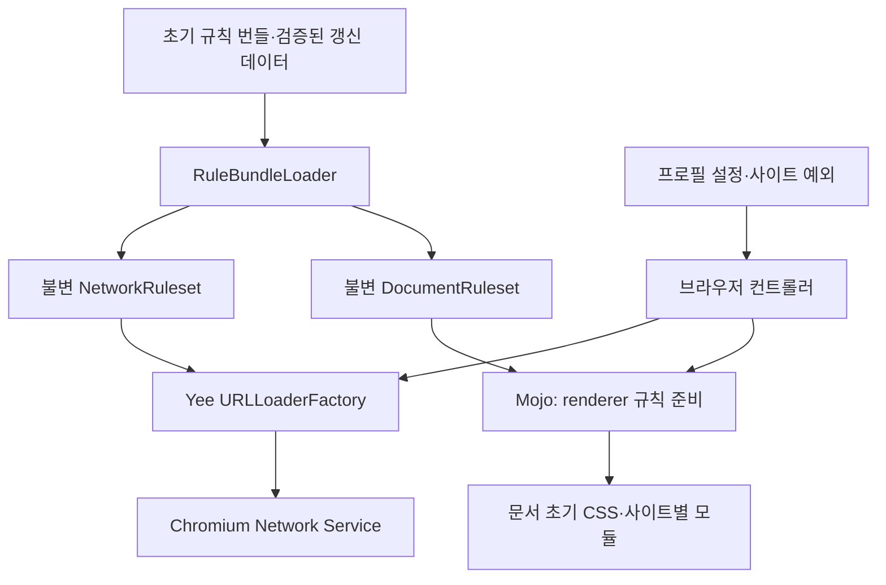

# Yee 네이티브 광고·트래커 차단 설계

작성일: 2026-09-12. 상태: 최초 설계와 대안 비교 기록.

후속 요청에서 엔진 원본 재사용을 검토하고 통합 구현을 진행했다. 현재 구현은
`adblock-rust` 원본을 유지하고 Yee 연결 계층을 독립 작성하는 방향이다.
최신 구조·구현 범위·검증 상태는 [`content-blocking-checkpoint.md`](content-blocking-checkpoint.md)를 따른다.
후속 라이선스 결정은 **본체 비공개를 유지하며 필터·의존성 소스 제공은 허용**하는 것이다.
GPL 목록·원본 scriptlet의 별도 패키지 구현은
[비공개 본체·공개 필터·원본 scriptlet](content-blocking-private-core-filter-data.md)를 따른다.
아래 C++ matcher 추천은 소스 제공 의무를 피하려던 이전 선호를 우선한 설계안이다.

사용자 요청은 광고·트래커 및 YouTube 광고 차단이다. 초기 작성 시의 선호는
**소스 제공 의무가 없는 의존성을 우선하는 것**이다. 따라서 초기 조사에서 제안한
MPL `adblock-rust` 대신, Chromium의 BSD 계열 매칭 코드와 Yee 자체 C++ 서비스,
Yee가 작성하는 사이트별 JavaScript 처리를 추천안으로 삼는다.

Brave의 구조를 조사한 사실과 아래의 Yee 설계 제안을 구분한다.
Brave와 같은 차단 품질이나 실제 YouTube 성공을 이미 달성했다는 문서가 아니다.

## 결정 요약

| 항목 | 추천 설계 |
| --- | --- |
| 네트워크 규칙 평가 | 기존 Chromium `UrlPatternIndex`를 이용한 C++ 구현 |
| 규칙 입력 | 작은 Yee JSON 스키마와 출처를 확인한 hosts 데이터 |
| 브라우저 통합 | Yee 전용 `URLLoaderFactory` interceptor, 프로필별 설정 |
| 페이지 광고 요소 | Blink의 CSS 삽입 기능과 제한된 동적 요소 처리 |
| YouTube | Yee가 작성하는 사이트별 처리 모듈과 데이터 규칙 |
| 업데이트 | 초기 번들 + 검증한 데이터 업데이트 + 이전 정상 버전 유지 |
| 코드 재사용 | 기존 Chromium 코드와 조건을 확인한 permissive 의존성 우선 |
| 초기 제품 제어 | 사이트별 활성/비활성 제안. UI 위치와 기본값은 미결 |

이 구조에서 작은 자체 구현이 가능한 부분은 설정, 요청 연결, 데이터 운영,
CSS 적용과 제한된 사이트별 처리다. 모든 uBO 문법과 모든 사이트별 예외를
재구현하는 작업까지 포함하면 작아지지 않는다. 초기에는 Yee가 지원하는 규칙 형식을
명확히 하고, YouTube의 가장 어려운 조건부터 먼저 검증한다.

## Brave Shields의 실제 구성

Brave 공개 master의 `6dde018a8c9a571045e671f1d8d526edfafa4290`
(commit 시각 2026-09-11 23:24:32 UTC)을 고정해 관련 소스 21개를 조사했다.
이는 집중 조사이며 Shields 전체 코드에 대한 전수 감사는 아니다.
로컬 Yee Chromium 기준은 `153.0.8005.0`,
`25189dfe0a49b3f8324586374b8251b8d12ad1c2`다.

### 요청 차단

Brave의 `BraveProxyingURLLoaderFactory`는 Chromium의 URLLoaderFactory 연결 사이에
들어가 요청 시작, redirect, 응답 전달과 취소를 처리한다. 광고 차단 판단을 기다리는
동안 진행을 보류하고, 차단 결과를 받으면 `ERR_BLOCKED_BY_CLIENT`를 전달하거나
필터에 지정된 대체 응답을 만든다.
[실제 factory 구현](https://github.com/brave/brave-core/blob/6dde018a8c9a571045e671f1d8d526edfafa4290/browser/net/brave_proxying_url_loader_factory.cc).

`brave_ad_block_tp_network_delegate_helper.cc`는 URL, initiator, 요청 종류, method와
보호 설정을 모아 별도 adblock 작업 sequence에서 평가한다. 필요하면 CNAME의
실제 도메인에 대해 다시 평가하며, proxy 설정에 따른 DNS 처리도 포함한다.
조사한 버전에는 YouTube initiator에 대해 aggressive 평가를 적용하는 분기도 있다.
[요청 판단 helper](https://github.com/brave/brave-core/blob/6dde018a8c9a571045e671f1d8d526edfafa4290/browser/net/brave_ad_block_tp_network_delegate_helper.cc).

### 엔진과 제품 정책

Rust `adblock-rust`는 필터 파싱·평가와 리소스 조회를 맡는다. CXX bridge가 C++ 호출을
연결하고, GN이 `rust_static_library`를 만든다.
[FFI](https://github.com/brave/brave-core/blob/6dde018a8c9a571045e671f1d8d526edfafa4290/components/brave_shields/core/common/adblock/rs/src/lib.rs),
[빌드](https://github.com/brave/brave-core/blob/6dde018a8c9a571045e671f1d8d526edfafa4290/components/brave_shields/core/common/adblock/rs/BUILD.gn).

C++ `AdBlockEngineWrapper`는 기본 목록과 추가 목록을 평가하는 두 엔진을 합친다.
first-party 보호 설정, 예외와 important 결과, 대체 리소스와 cosmetic 결과의 병합도
이 wrapper가 처리한다. 일부 동작은 feature flag에 따라 달라진다.
[wrapper](https://github.com/brave/brave-core/blob/6dde018a8c9a571045e671f1d8d526edfafa4290/components/brave_shields/content/browser/ad_block_engine_wrapper.cc).

즉, Rust 엔진과 Brave의 보호 수준·목록 병합 정책은 다른 책임이다.
Yee에서 엔진이나 구조를 재사용하더라도 Brave의 제품 정책을 자동으로 가져올 이유는 없다.

### 페이지 처리

`CosmeticFiltersJsRenderFrameObserver`는 navigation commit 준비 시 리소스를 준비하고
document-start에 규칙을 적용한다. 동기/비동기 조회 경로와 navigation 변경 시
이전 callback 무효화가 있다.
[renderer observer](https://github.com/brave/brave-core/blob/6dde018a8c9a571045e671f1d8d526edfafa4290/components/cosmetic_filters/renderer/cosmetic_filters_js_render_frame_observer.cc).

`CosmeticFiltersJSHandler`는 Mojo로 리소스를 받고, user-origin CSS를 삽입하며,
isolated world에 cosmetic 처리 코드를 실행한다. 조사한 scriptlet 경로는 isolated
world에서 wrapper를 실행한 뒤 script element를 통해 페이지 실행 환경에 코드를
넣는다. 페이지 함수를 처리하는 코드와 isolated world의 관리 코드를 구분해야 한다.
[JS handler](https://github.com/brave/brave-core/blob/6dde018a8c9a571045e671f1d8d526edfafa4290/components/cosmetic_filters/renderer/cosmetic_filters_js_handler.cc).

동적 cosmetic 처리는 MutationObserver, class/id 수집, 큐와 작업 throttling을 사용한다.
단순히 일정 주기로 모든 DOM을 지우는 기능으로 구현되어 있지는 않다.
[페이지 처리 코드](https://github.com/brave/brave-core/blob/6dde018a8c9a571045e671f1d8d526edfafa4290/components/cosmetic_filters/resources/data/content_cosmetic.ts).

### 목록 운영과 다른 privacy 기능

`AdBlockService`에는 필터 provider, 리소스 provider, 사용자 구독, 목록 catalog,
캐시와 updater 연결이 있다. 초기 캐시와 리소스 도착 시점도 관리한다.
이 운영 계층이 Shields 전체를 그대로 이식하기 어렵게 만드는 부분이다.
[서비스](https://github.com/brave/brave-core/blob/6dde018a8c9a571045e671f1d8d526edfafa4290/components/brave_shields/content/browser/ad_block_service.cc).

쿠키·스토리지 보호와 fingerprinting 방어는 content settings 및 Blink 변경 등
다른 계층에도 걸친다. Rust 광고 엔진으로 Shields 전체를 설명할 수 없다.
[Shields 보호 범위](https://brave.com/shields/).

## 자체 구현과 재사용 비교

| 접근 | 장점 | 비용·한계 | 이번 설계에서의 위치 |
| --- | --- | --- | --- |
| Brave Shields 통합 코드 이식 | 기존 기능이 풍부함 | MPL 파일, Brave의 updater·prefs·request context 등 다수 의존성 | 채택하지 않음 |
| `adblock-rust` + Yee 자체 연결 | 성숙한 규칙 평가 재사용 | MPL 소스 제공 범위가 남고 scriptlet 리소스도 별도 필요 | 비교안으로 보존 |
| Chromium matcher + Yee 자체 연결 | 기존 C++ 빌드와 결합, 작은 책임 경계 | 고급 필터와 사이트 대응을 직접 관리 | 추천 |
| 새 matcher까지 전부 작성 | 형식을 자유롭게 통제 | URL 경계·도메인·예외·색인·성능 검증을 다시 수행 | 필요성이 확인되기 전까지 채택하지 않음 |

`UrlPatternIndex`는 FlatBuffers 기반 URL 규칙 색인과 wildcard/anchor, 도메인,
요청 유형 등의 평가를 제공한다. 독립적인 C++ 컴포넌트여서 native 사용에 확장
프로그램 설치가 필요한 것은 아니다.
[Chromium 설계](https://source.chromium.org/chromium/chromium/src/+/25189dfe0a49b3f8324586374b8251b8d12ad1c2:components/url_pattern_index/README.md).

그러나 전체 광고 차단 엔진은 아니다. 현재 로컬 `url_pattern_index.cc`의 proto 규칙
색인 경로는 REGEXP를 거부한다. Chromium DNR의 정규식 처리는 별도 코드에 있다.
EasyList용 `RuleParser`도 일부 옵션을 거부하며 uBO scriptlet 실행기를 제공하지 않는다.
스키마에 필드가 있거나 파싱에 성공했다는 것과 실제 처리 지원은 구분한다.
[matcher](https://source.chromium.org/chromium/chromium/src/+/25189dfe0a49b3f8324586374b8251b8d12ad1c2:components/url_pattern_index/url_pattern_index.cc),
[parser](https://source.chromium.org/chromium/chromium/src/+/25189dfe0a49b3f8324586374b8251b8d12ad1c2:components/subresource_filter/tools/rule_parser/rule_parser.cc).

## Yee 구성과 실행 경로



초기에는 아래 여섯 책임으로 구성한다. 엔진 플러그인 시스템이나 범용 규칙 언어를
추가하지 않는다.

| 책임 | 수행 내용 |
| --- | --- |
| `RuleBundleLoader` | 스키마·출처·크기·버전 검증, worker에서 규칙 색인 생성 |
| `NetworkRuleset` | 불변 색인과 메타데이터, 요청 평가와 결정 반환 |
| `ContentBlockingService` | 프로필 설정, 유효 번들과 설정 revision, renderer 준비 |
| `FilteringURLLoaderFactory` | 요청·redirect 평가, 차단 오류 전달, 연결 수명 관리 |
| `DocumentFilterAgent` | 문서별 규칙 선택, CSS와 사이트 모듈 적용, navigation 수명 관리 |
| `SiteAdapters` | Yee가 작성한 YouTube 등 제한된 사이트 처리 코드 |

### 네트워크 경로

`ChromeContentBrowserClient::WillCreateURLLoaderFactory()`의 얇은 helper에서
`URLLoaderFactoryBuilder::Append()`로 Yee interceptor를 연결한다.
이 builder는 Append 순서대로 요청을 전달한다. 확장·인증 interceptor 다음에
Yee를 연결하는 것을 초기 후보로 삼고, 확장 redirect와 실제 서버 redirect가
모두 재평가되는지 첫 통합 테스트에서 확인한다.

factory의 Mojo receiver와 매칭은 브라우저 프로세스의 전용 sequence에서 수행한다.
UI thread에서는 프로필·프레임 문맥을 만들고 설정 변경을 전달한다. 요청마다
UI thread에서 목록을 파싱하거나 프로필 객체를 작업 sequence에서 역참조하지 않는다.
이 sequence 배치는 제안이며 proxy API와 수명 검증이 첫 checkpoint에 포함된다.

요청 평가 입력은 URL, 검증된 initiator, 요청 유형, method, 가능한 top-level site,
규칙 generation과 설정 revision이다. 초기 결과는 allow/block,
규칙 ID와 generation이다. 상세 URL 로그를 제품의 기본 기록으로 삼지 않는다.

명시적인 사이트 해제는 평가 전에 적용한다. 각 요청은 시작 시의 불변 규칙·설정
snapshot을 참조한다. redirect마다 새 대상 URL을 평가하고, 취소/연결 종료 후
늦게 도착한 callback으로 요청을 재개하지 않는다.
문서에 귀속된 요청은 해당 문서의 generation을 사용한다. navigation은 선택한
generation을 새 문서에 전달한다. worker·prefetch처럼 문서 귀속이 다른 경로는
generation 전달 규칙을 따로 검증한다. factory clone도 이 문맥과 수명을 보존해야 한다.

### 문서 초기 처리

renderer에는 DocumentRuleset과 내장 사이트 모듈을 미리 준비한다. 새 문서에서
필요한 처리를 시작할 때 브라우저 조회나 다운로드를 기다리는 구조를 기본으로 삼지 않는다.
renderer 준비가 끝나기 전에 navigation이 commit되지 않도록 하는 연결은
첫 timing checkpoint에서 검증한다. 동기 Mojo 조회는 기본 설계에 넣지 않는다.

CSS는 Blink의 user-origin stylesheet 삽입 경로를 사용한다. CSS selector 자체는
나중에 생성된 요소에도 적용되므로 일반 CSS 규칙 때문에 전체 DOM 관찰기를
항상 실행할 필요는 없다. 별도 관찰이 필요한 사이트 처리만 범위를 제한하고 합쳐서 처리한다.

페이지의 fetch/XHR·초기 데이터 처리는 페이지 실행 환경에 필요한 제한된 모듈을
document-start 또는 더 이른 검증된 시점에 설치한다. 관리 코드는 isolated world에
둔다. 실행 순서·CSP·scripts-disabled 상태·iframe 경계를 실제 Chromium에서 확인한다.
native 삽입이라는 이유로 모든 CSP나 sandbox 동작이 해결됐다고 가정하지 않는다.

문서마다 document token과 generation을 유지한다. 다른 문서의 payload를 적용하지 않고,
같은 문서의 SPA 이동에서는 이미 설치한 모듈을 중복 설치하지 않는다.
BFCache 복원은 해당 문서의 generation과 설치 상태를 유지한다.
사이트 해제 후 기존 hook/CSS를 확실하게 정리하는 v1 방식은 reload를 제안한다.

## 작은 규칙 형식

첫 버전은 전체 ABP/uBO 문법 호환을 목표로 삼지 않는다. 자체 JSON에는 다음만 담는다.

- Network: rule ID, block/allow, 제한된 URL filter, 요청 유형·method·도메인 조건과 priority.
- Document: 사이트 조건, CSS selector 목록, 내장 모듈 ID와 제한된 데이터 인자.
- Bundle: schema version, generation, 출처·라이선스·입력 hash, 호환 버전.

URL filter는 Chromium이 제공하는 wildcard/anchor 하위 집합을 사용한다.
동일 priority의 allow는 block보다 우선하며, 더 큰 priority를 우선하는 것을
Yee 형식의 명시적 규칙으로 제안한다. 사용자 사이트 해제는 이 우선순위보다 먼저 적용한다.
이것을 uBO의 `important`/`badfilter`와 동일한 문법 지원이라고 부르지 않는다.

hosts는 DNS 설정을 수정하지 않고, 확인한 host별 native 차단 규칙으로 변환한다.
정확 host와 subdomain까지 차단하는 규칙은 구분한다. `localhost`, loopback과
hosts 파일의 단순 주소 매핑을 광고 도메인으로 오인하지 않는다.

처음부터 넣을 필요가 없는 기능은 일반 정규식, 대체 응답 리소스, 임의 JS 필터, 사용자 scriptlet 편집,
전체 HTML 응답 재작성과 uBO 전체 procedural selector다.
향후 필요한 기능은 독립적인 수용 기준을 가진 스키마 확장으로 추가한다.
모르는 필수 필드·모듈이나 지원하지 않는 조건이 있으면 갱신 번들을 거부한다.
조건을 지워 더 넓은 규칙으로 실행하지 않는다.

## YouTube 자체 처리

이 부분이 추천안에서 가장 큰 기술·유지보수 불확실성이다.
YouTube adapter를 작은 임의 광고 건너뛰기 스크립트로 완료 처리하지 않는다.

1. 실제 일반 계정과 비로그인 재생에서 광고 데이터와 본 영상 데이터의 전달 경로를 관찰한다.
2. 확인한 경로에 한해 초기 player 데이터와 fetch/XHR JSON 처리 hook을 설치한다.
3. 광고 관련 데이터만 처리하고 status, headers, 본 영상·자막·화질·재생목록 정보를 보존한다.
4. SPA 이동과 iframe에서 적용 범위·중복 설치를 확인한다.
5. 광고 차단 감지·재생 실패·스트림 결합 변형은 개별 관찰과 대응을 요구한다.

기능 코드는 Yee가 독립적으로 작성하고 Chromium API와 실제 프로토콜 관찰로 검증한다.
번들 데이터에는 확인한 endpoint 조건과 제한된 JSON 경로 등만 넣는다.
새 처리 기능을 추가하는 JavaScript 코드는 앱 릴리스로 배포하고, 기존 기능의
데이터 규칙은 호환 버전 내에서 별도 갱신할 수 있게 한다.

현재 필터가 사용하는 여러 대응을 구현 후보를 찾는 조사 자료로 볼 수는 있지만,
GPL uBO 또는 MPL Brave 코드를 번역·이름 변경해 Yee의 독자 코드로 취급하지 않는다.
최신 필터를 그대로 가져오는 이점은 이 추천안에서 사용할 수 있는 전제로 두지 않는다.

수용 기준은 **광고 영상과 소리가 재생되지 않으면서 본 영상이 정상 재생되는 것**이다.
광고를 잠깐 재생한 뒤 seek·mute하는 결과는 별도 fallback이며 이 기준의 성공으로
계산하지 않는다. Premium 계정이나 원래 광고가 없었던 영상만으로도 검증하지 않는다.
재생 감지 실패 시 영상 전체를 차단하는 동작은 사용자 요구가 아니므로 자동으로 추가하지 않는다.

## 요청·문서 범위와 수명

| 경로 | 설계·검증 기준 |
| --- | --- |
| 일반 document fetch/XHR·image·script·media | factory 경로에서 시작 전 평가, 허용 요청의 정상 전달 |
| main-frame navigation·iframe | trusted navigation 문맥, 차단 오류와 redirect 재평가 |
| dedicated worker | 가능한 소유 문서·site 문맥 전달, worker script와 subresource 확인 |
| shared/service worker | 정확한 top-site 문맥이 없는 요청의 정책을 별도로 검증; 임의 탭의 예외를 적용하지 않음 |
| keepalive·sendBeacon | renderer 종료 뒤에도 정책·연결 수명이 유지되는지 확인 |
| prefetch·early hints | 해당 factory 경로 확인. URLLoaderThrottle 하나로 전체 적용을 주장하지 않음 |
| service worker의 자체 캐시 응답 | network interceptor를 지나지 않을 수 있음. document 처리와 network 보호 범위를 구분 |
| WebSocket·WebTransport | URLLoaderFactory와 다른 API 경로에 대해 별도 연결 필요 여부 확인 |
| about:blank·srcdoc·sandboxed iframe | inherited/opaque origin 규칙, 문서별 CSS·script 범위를 timing checkpoint에서 검증 |
| BFCache·prerender | 실제 활성 문서·generation과 연결, 중복 주입 및 이전 문서 callback 방지 |

이 표는 모든 경로가 이미 지원된다는 뜻이 아니다. 적용하지 못한 경로는 구현 checkpoint의
잔여 작업으로 남기고, 제품의 보호 범위를 제한해서 기록한다. 요청 문맥이 없다는 이유로
모든 host 차단을 해제하지 않는다. 문맥 의존 조건은 Unknown 상태를 명시적으로 처리한다.

## 데이터 운영과 라이선스

이번 선호는 소스 제공 의무가 없는 의존성 우선이다. MIT/BSD/Apache 계열도
저작권·라이선스 고지 등 조건은 유지해야 하며, 이를 무조건으로 해석하지 않는다.
이 정책은 이번에 추가하는 차단 코드·데이터의 선택 기준이며 기존 Chromium 전체의
라이선스 점검을 대체하지 않는다.

| 자료 | 확인 결과 | 이번 기본 번들 방침 |
| --- | --- | --- |
| Chromium `UrlPatternIndex`와 관련 자체 glue | Chromium 파일의 BSD-style 고지 | matcher 재사용, 선택한 타깃의 의존성 고지도 확인 |
| `adblock-rust`, Brave 차용 파일·리소스 | MPL-2.0 | 추천안에 기본 포함하지 않음 |
| uBO scriptlet | GPL-3.0-or-later 고지 | 기본 포함하지 않음 |
| EasyList/EasyPrivacy | 일반적으로 GPL-3.0-or-later 또는 CC-BY-SA-3.0-or-later | 데이터의 별도 조건이 있어 초기 기본 번들에 자동 포함하지 않음 |
| StevenBlack의 개별 자체 hosts 데이터 | README에서 MIT 표기 | 정확한 입력 파일·고지를 확인하는 후보 |
| AdAway hosts | 파일에 CC-BY-3.0 표기 | attribution 조건을 확인하는 개별 후보 |
| hosts 통합본 | 원본별로 MIT·CC-BY·CC-BY-SA·NC 등이 혼재 | 통합 저장소의 대표 라이선스만 보고 채택하지 않음 |
| Yee 사이트 모듈과 자체 규칙 | 독립 작성 | 기본 사이트 대응 |

근거: [Chromium 라이선스](https://github.com/chromium/chromium/blob/main/LICENSE),
[Brave 리소스 라이선스](https://github.com/brave/adblock-resources/blob/master/LICENSE),
[uBO scriptlet 고지](https://github.com/gorhill/uBlock/blob/master/src/js/resources/scriptlets.js),
[EasyList 조건](https://easylist.to/pages/licence.html),
[hosts 원본별 조건](https://github.com/StevenBlack/hosts#sources-of-hosts-data-unified-in-this-variant),
[AdAway 파일 고지](https://github.com/AdAway/adaway.github.io/blob/master/hosts.txt).

MPL 비교안 자체가 Yee 전체 소스 공개를 요구하는 것은 아니다. 외부 배포 시 포함된
MPL 부분과 수정본의 소스를 제공하고 받는 방법을 안내해야 하며, 독립적인 별도 Yee
파일은 같은 의무가 적용되지 않는다. 정적 링크도 이 파일 단위 원칙을 바꾸지 않는다.
내부 사용·수정 단계에는 같은 배포 의무가 발생하지 않는다.
[Mozilla FAQ Q5–Q11](https://www.mozilla.org/en-US/MPL/2.0/FAQ/),
[MPL §3](https://www.mozilla.org/en-US/MPL/2.0/).

업데이트는 출처와 입력 hash를 보존한 검증 번들을 단위로 한다. 제공 경로가 정해지기
전에는 초기 번들과 로컬 교체 검증으로 시작한다. 네트워크 갱신 단계에서는 크기 제한,
스키마·호환 버전 검증, 인증된 manifest와 이전 정상 버전 복구를 갖춘다.
hash만으로 제공자의 진위를 검증할 수 있다고 가정하지 않는다.

네트워크 규칙과 document 데이터는 하나의 generation으로 배포한다. 준비를 마친
새 generation은 새 문서에 적용하고 기존 문서는 이전 snapshot을 유지한다.
유효 기간이나 갱신 실패만으로 현재 정상 규칙을 폐기하지 않는다.

## Overlay·빌드 경계

구현 소스는 `src/` 아래에 둔다. product UI는 기존 Views 위치를
사용하고, backend와 renderer는 별도 책임·GN 타깃을 제안한다.

```text
src/
  components/yee_content_blocking/         공통 형식·matcher·규칙 데이터
  chrome/browser/yee_content_blocking/     프로필 서비스·factory·loader
  chrome/renderer/yee_content_blocking/    document agent·사이트 모듈
  chrome/browser/ui/views/yee/             필요한 제품 UI
```

기존 installer는 Views 폴더 바로 아래 파일만 복사한다. macOS/Windows installer를
같은 overlay root의 상대 경로로 복사하도록 확장하는 것이 필요하다.
기존 UI 소스의 목적지는 유지한다.

Chromium originals에는 build dependency와 content client에서 Yee helper를 호출하는
최소 glue만 둔다. renderer가 browser 서비스 구현이나 Views를 링크하지 않는다.
공통 형식과 Mojo 인터페이스를 통해 통신한다. `TabStripModel`과 Agent/MCP bridge에
차단 정책을 넣지 않는다.

glue 변경은 기존 `0001-integrate-yee-shell.patch`에 포함하며, 실제 Chromium diff를
검증해 재생성한다. 다른 세션의 변경 파일을 덮어쓰거나 이전 patch로 되돌리지 않는다.
현재 설계 단계에는 installer·glue·앱 코드를 변경하지 않았다.

## 구현 checkpoint와 완료 기준

### 0. 가장 어려운 조건의 feasibility

- Chromium matcher로 host 경계·wildcard·allow 예외를 작은 native 타깃에서 검증한다.
- document-start 이전 준비와 주입 순서를 local fixture의 첫 inline script로 확인한다.
- 제한된 초기 YouTube 모듈로 실제 일반 계정/비로그인 재생 가능성을 먼저 확인한다.
- 세 단계의 결과로 자체 구현의 범위와 유지 비용을 재평가한다. 핵심 재생 조건이
  실패한 상태에서 일반 차단 UI를 구현하고 완료로 처리하지 않는다.

### 1. 구조 checkpoint

- core/browser/renderer 타깃과 overlay 동기화를 연결한다.
- 실제 factory chain, 문맥과 수명, 정상 요청 보존을 확인한다.
- 다른 MCP 세션의 프로필·실험 설정을 바꾸지 않는 명시적 개발 설정으로 검증한다.

### 2. 광고·트래커 및 페이지 처리

- 확인한 목록과 자체 규칙을 연결하고 host·URL·요청 종류 조건을 검증한다.
- CSS, iframe, SPA, reload와 BFCache 동작을 확인한다.
- 필터 실패가 로그인·결제·영상 재생을 깨뜨리는지 실제 사이트에서 확인한다.

### 3. YouTube와 데이터 운영

- 시작 전/중간 광고의 영상·소리 차단, 본 영상·자막·화질·탐색 보존을 확인한다.
- 로그인/비로그인, 일반 영상/Shorts/라이브/임베드/재생목록을 나누어 기록한다.
- 규칙 버전·계정 상태·재생 유형을 남겨 서버 A/B 변형과 비교한다.
- 번들 실패·중단·호환 버전 오류·복구와 문서 generation 일관성을 검증한다.

### 4. 제품 기본값과 실앱 gate

- 사이트별 해제와 보호 상태 표시 위치를 사용자와 확정한다.
- 필요한 native·통합 테스트와 `build.sh`를 수행한다.
- 새 빌드의 실앱 검증 전에는 저장소 규칙대로 모든 Yee browser를 graceful shutdown한다.
- Browser Surface/Omnibox/Side Panel 레이아웃을 바꾸는 경우에 해당 tier의 layout gate를
  함께 수행한다. backend 변경만으로 heavy layout gate를 매번 실행하지 않는다.

검증은 차단 요청이 fixture 서버에 도착하지 않는지, 허용 요청의 응답이 유지되는지,
실제 광고와 소리가 재생되지 않는지를 각각 확인한다. 차단 count나 mockup 화면만으로
완료를 판단하지 않는다.

성능은 같은 프로필 조건·규칙 generation에서 off/on, cold/warm cache를 비교한다.
전체 CPU/RSS·전송량·페이지 로딩·재생 시작 지연과 매칭 sequence의 지연을 측정한다.
동적 페이지 처리의 long task와 추가 IPC도 포함한다. 현재 개선 수치나 구현 기간은
측정 근거가 없어 확정하지 않는다.

## 남은 제품 결정

사이트 예외의 범위(origin/host/site), 최초 보호 기본값, 사이트 해제 시 reload UX,
설정·상태의 노출 위치는 구현 UI 전에 확정한다. 기존 Omnibox의
Site info → Address → Bookmark 계약과 예약 Sidebar 슬롯을 이 설계로 변경하지 않는다.
자동으로 보호를 끄는 호환성 정책과 서버 광고 변형에 대한 fallback도 별도 결정이다.

쿠키·스토리지 격리, fingerprinting, CNAME 강화는 이번 광고 엔진 설계와 구분한
후속 범위다. 첫 버전을 Shields 전체와 동등하다고 표현하지 않는다.
